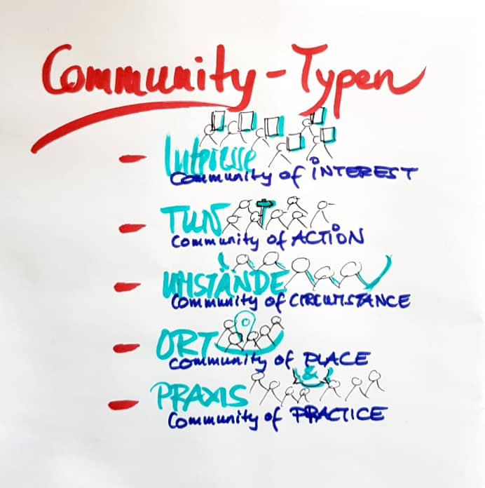

## Definitionen

Was versteht ihr unter Communities? Stellt diese Frage 10 Personen, und
ihr bekommt 15 verschiedene Antworten. Vielleicht stimmen die Zahlen in
dieser Zuspitzung nicht ganz, aber Fakt ist: Mit Communities und
Community Management können noch viele wenig anfangen. Oder ihre
Konnotationen sind unscharf. Und natürlich hält auch die Fachliteratur
unterschiedliche Definitionen bereit oder nutzt verschiedene
Systematiken und Terminologien, um Community-Typen voneinander zu
differenzieren.

Wer Communities in Unternehmen einführen will, muss Begrifflichkeiten
rund um Communities überlegt einsetzen. Denn letztlich wird er oder sie
auf viele Menschen in allen Führungsebenen treffen, bei denen
“Communities” mit unterschiedlichen Vorstellungen verbunden sind. Wir
geben im Folgenden einen kleinen Überblick über die gängigen
Begrifflichkeiten in der Fachliteratur und legen dar, welche Begriffe
wir im lernOS Community Management Guide verwenden. Im Anhang könnt ihr
euch die erwähnten Definitionen verschiedener Quellen ausführlich
anschauen.

### Communities in der Fachliteratur

Einige Begriffe für Communities und ihre speziellen Ausformungen im
Unternehmen, auf die wir uns immer wieder beziehen, kommen aus der
Fachliteratur von Richard Millington, Etienne und Beverly Wenger-Trayner
sowie Gartner. Die Typisierungen weisen Überschneidungen auf,
gleichzeitig auch unterschiedliche Schwerpunktsetzungen und
Perspektiven.

**Richard Millington** unterscheidet Communities in erster Linie nach den
Inhalten, die jeweils für Zusammenhalt und Beziehungsinteresse sorgen [(Quelle Millington)](https://stangarfield.medium.com/types-of-communities-enterprise-social-network-groups-a-trail-that-collects-77df73ec2c8f):

+ **Community of Interest** - Communities von Menschen, die ein gemeinsames Interesse teilen.
  
    Vielleicht die bekannteste Community-Form. Gemeinsame Interessensgebiete können alles sein, von Fernsehsendungen, die Liebe zu seltenen Münzen oder eine Vorliebe für Schwerter. Verbindend ist hier die Leidenschaft fürs Thema.
  
    Interne Anwendungsfälle: Gamer-Community, Vegane Community, Foto-Community, Visual Thinking Community, Lauftreff

+ **Community of Action** - Communities von Menschen, die Veränderungen bewirken möchten.
  
    Aktions-Communities setzen sich dafür ein, die Welt zu verändern. Dazu gehören die meisten gemeinnützigen und politischen Community-Initiativen. Viele andere Arten von Communities entwickeln sich im Laufe der Zeit immer mehr zu einer aktivistischen Kraft, die sich für ihr Thema einsetzt.
  
    Interne Anwendungsfälle: Botschafter-Community, Diversity-Community, Postkoloniale Community (Veränderung der Entwicklungsarbeit (GIZ)), “Let’s Du it” Community (interner Kulturwandel)

+ **Community of Circumstance** - Communities von Menschen, die durch externe Situationen oder Ereignisse verbunden sind.
  
    Die bestimmte, verbindende Lebenssituation stiftet hier Sinn und Zusammenhalt. Hierzu zählen die meisten Gesundheits-Communities, LGBTQI-Gruppen und andere, die aus einem gemeinsamen Eigeninteresse heraus angetrieben werden. Diese Communities sind oft sehr stark. Die Überschneidungen zu Communities of Action sind fließend.
  
    Interne Anwendungsfälle: Alleinerziehende-Community

+ **Community of Place** - Communities von Menschen, die durch gemeinsame geographische Grenzen verbunden werden.
  
    Eigentlich die ursprünglichste, vor-digitale Form der Community. Hier stiftet der Standort Zusammenhalt - die Zugehörigkeit zu einer Nachbarschaft, Gemeinde, Stadt, Region etc.
  
    Interne Anwendungsfälle: Standort-Community

+ **Community of Practice** - Communities von Menschen, die gemeinsam Themen und Arbeitspraxis weiterentwickeln möchten.
  
    Diese Communities setzen sich aus Mitgliedern zusammen, die ähnliche Tätigkeiten ausüben oder durch thematische Überschneidungen verbunden sind. Beispielsweise eine Community, die auf einem Job- oder Aufgabenprofil basiert. Der häufigste Anwendungsfall bei geschäftsorientierten Communities.
  
    Interne Anwendungsfälle: Communities zu Rollen (z.B. "Scrum master") oder Themen (z.B. "Artificial Intelligence"), Fachcommunities

**Wenger-Trayner** dagegen trifft Unterscheidungen in erster Linie auf Basis
der Formalität, zeitlichen Bestimmtheit und der Treiber des Wunsches
nach Zusammenarbeit. Er unterscheidet folgende zentrale Arten vernetzten
Arbeitens und Lernens [(Quelle Wenger)](https://socialnow.org/teams-communities-networks-core/):

+ **Netzwerk**- Informeller Austausch von Geschäftsinformationen. Stärkung von Beziehungen und Zusammenhalt.
  
    Informelle Netzwerke bilden die Summe der zwischenmenschlichen Verbindungen einer Person innerhalb einer Organisation ab. Sie verbinden Personen mit anderen Teams und Einheiten. Netzwerke entstehen häufig informell und entziehen sich der Sichtbarkeit. Mitglieder kommen Anlassbezogen zusammen, z. B. Netzwerk-Events und verfolgen Individual-Interessen (Job-Angebot, Auftrag, Kontaktvermittlung etc.). Organisierte Community-Events dienen oft genauso sehr der offiziellen Themenentwicklung wie dem informellen Netzwerken.
    Interne Anwendungsfälle: Job-sharing-Community, Berufliche Netzwerke, Jahrgangsgruppen, Alumni-Netzwerke
- **Formale Arbeitsgruppe oder Projektteam** - Lieferung eines Produkts oder Services, bzw. Erfüllen einer spezifischen Aufgabe
  
    Zweckbestimmte, interdisziplinäre, cross-divisionale Gruppe, die mit einer gemeinsamen Aufgabenstellung betraut ist. zu arbeiten. Oft für einen konkreten Anlass aufgesetzt, mit klarer Arbeitsteilung.
    Interne Anwendungsfälle: Kommen intern häufig vor. Sind, anders als Communities of Practice, auf Zeit angelegt. Können Teil einer Community sein.

- **Community of Practice** - Gruppe von Personen mit einem gemeinsamen Interesse, die durch regelmäßige Interaktion voneinander lernen
  
    Wengers ursprüngliche Definition von Communities of Practice beinhaltet die Pfeiler “Gruppen von Menschen; Leidenschaft für die Weiterentwicklung eines Themas; Lernen und regelmäßige Interaktion und beschreibt damit in wenigen Worten gut, was Communities of Practice im wesentlichen ausmacht. Er definiert innerhalb des Rahmens Community of Practice verschiedene Ausrichtungen - etwa die “Helping community”, in der sich Mitglieder gegenseitig mit alltäglichen Fragestellungen unterstützen, die “Best Practice Community”, die für die Verbreitung von Good Practice, Guidelines und Strategien sorgt sowie “Innovation-Communities”, bei denen der Fokus auf Ko-Kreation liegt, oder “Knowledge Stewarding Communities”, die Wissen kuratieren, aufbereiten und verfügbar machen. Die meisten Communities tun all das, und noch mehr, wenn auch oft in unterschiedlichen Ausprägungen.
    Interne Anwendungsfälle: Fachcommunities, Innovations-Communities, Community-Manager-Community

### Welche Begriffe verwenden wir im Guide?

- **Community:** Communities sind Gruppen von Menschen, die gemeinsame
  oder einander ergänzende Interessen haben und die im Zusammenkommen
  und Interagieren eine Möglichkeit sehen, geteilte und individuelle
  Ziele zu erreichen. Im Zentrum der Community stehen immer die
  Aktivitäten und Beziehungen der teilnehmenden Menschen, auch wenn
  diese Menschen sich schwerpunktmäßig über eine Online-Plattform
  organisieren oder entsprechende digitale Kanäle nutzen. In der
  Praxis werden oft sehr erfolgreich verschiedene
  Interaktionsplattformen oder -Kanäle kombiniert, so etwa, wenn sich
  eine Online-Community zu einen physischen Community-Event trifft.
  Eine Online-Community-Plattform ohne Aktivitäten ist keine
  Community.

- **Community Management:** Community Management ist die Bezeichnung
  für alle Methoden und Tätigkeiten rund um Konzeption, Aufbau,
  Leitung, Betrieb, Betreuung und Optimierung von virtuellen
  Gemeinschaften sowie deren Entsprechung außerhalb des virtuellen
  Raumes. Unterschieden wird dabei zwischen operativen, den direkten
  Kontakt mit den Mitgliedern betreffenden, und strategischen, den
  übergeordneten Rahmen betreffenden Aufgaben und Fragestellungen
  (Quelle: [BVCM 05.2010](https://www.bvcm.org/2010/05/veroffentlichung-der-offiziellen-definition-community-management/)).

- **Community of Practice (CoP):** Communities of Practice (CoP) sind
  Gruppen von Personen mit einem gemeinsamen Interesse, die durch
  regelmäßige Interaktion voneinander lernen (nach Wenger-Trayner).

- **(Virtuelles oder hybrides) Team:** Individuen, die für eine
  gemeinsame ständige Aufgabenstellung oder ein Projekt
  zusammenarbeiten. In der Regel sind Teams Einheiten der formalen
  Organisation, mit einem formalen Arbeitsauftrag und formaler
  Arbeitsteilung. (Wenger: Arbeitsgruppe, Projektteam) Die Praxis von
  Communities für interne Teams beschreibt die Definition von
  Katharina Krentz von Bosch: “Eine Online Community ist zudem eine
  virtuelle, themenbasierte Arbeitsumgebung, die Teams mit gleichen
  Interessen und Aufgaben eine Heimat bieten kann. Hier kann mit
  verschiedenen Funktionen effizienter an einem Thema
  zusammengearbeitet werden, als klassisch per E-Mail. Alle
  Informationen sind zentral an einem Ort verfügbar und können überall
  von jedem Device bearbeitet werden.”
