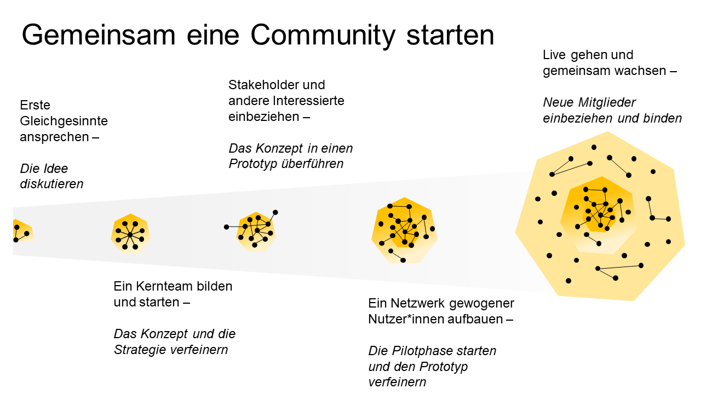

##Als Team starten

Never dance alone - Communities sind Gemeinschaftswerke und entstehen am
besten aus dem Engagement einer Kerngruppe heraus. Sie setzt den Ton,
agiert als Vorbilder, inspiriert andere zum Mitmachen. Ihre besondere
Stellung ist jedoch nicht Selbstzweck, sondern sie möchte letztlich
andere Mitglieder auf Augenhöhe heben, ihr Engagement zu etwas
Gleichrangigem und Natürlichem machen. Sehr anschaulich erzählt das
dieses Video: [Leadership Lessons from a Dancing Guy](https://youtu.be/fW8amMCVAJQ).

Das Kernteam wächst wahrscheinlich aus der Gruppe von Menschen, die sich
zu Beginn mit einer unbestimmten Idee zusammengefunden haben und von
denen die Initialzündung zur Gründung der Community ausgegangen ist.
Schon hier, in den Anfängen, lassen sich die Weichen für eine Kultur der
Beteiligung legen, die andere bewusst einbezieht und inhaltliche Impulse
und Angebote der Mitwirkung weiterer Interessierter willkommen heißt.
Denn eine Community sollte immer starten, bevor sie fertig ist. Konkret
heißt das, auch die unfertige Idee mit anderen zu teilen und Feedback
aktiv einzufordern. Zunächst sind die Gesprächspartnerinnen vielleicht
Stakeholder, dann folgen direkt besonders günstig gestimmte Menschen -
(potenzielle) Power-Nutzerinnen oder Multiplikatoren.

*“Start before you’re ready” oder: Eine Community gemeinsam mit anderen
starten. Visualisierung inspiriert durch* *<u>Peter Staal</u> (2021).*
*Quelle: Daimler, Achim Brueck.*

Indem ihr diesen Ansatz von Anfang an konsequent und für alle sichtbar
verfolgt, sinkt die Hemmschwelle für alle weiteren Community-Mitglieder.

Auch für diejenigen in spe, die potenziellen. Euer Ziel sollte es
  sein, aktive Beteiligung normal werden zu lassen. Baut einen Raum auf,
  in dem Beiträge geschätzt werden und Menschen einander vertrauen. In dem
  sie Fehler machen dürfen und ernst genommen werden. Likes, Kommentare,
  eigene Posts, Ermutigungen etc. können dies in der Online-Community ganz
  handfest unterstützen.

Ab einem gewissen Stadium braucht eure Community vielleicht stabilere
Strukturen. Aber auch hier gilt: Ihr könnt dazu klare Rollen und
Verantwortlichkeiten definieren, oder ein fluides Konzept des
Co-Managements mit wechselnden Zuständigkeiten etablieren - wie es euch
besser liegt.
