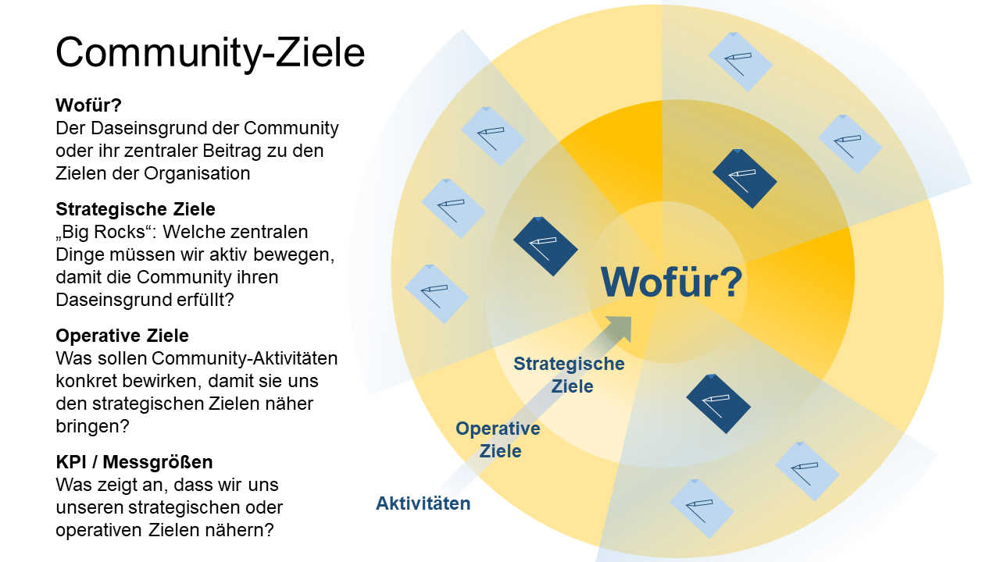

# Konzeption und Planung

### Hilfsmittel, um die Community zu skizzieren

Die Verschiedenheit von Communities schlägt sich in Unterschieden in
ihren Konzepten und Aktivitäten nieder. Das wird für die ersten
strategischen Überlegungen ebenso gelten, wie für die Ausgestaltung
ihrer Pilot-Phasen, des Go-Lives oder weiterer Maßnahmen. Strukturell
gleichen sich jedoch die zu klärenden Themen, und hier kommen einige
praktische Hilfsmittel ins Spiel.

Ihr könnt damit starten, eure Community mit diesen Hilfsmitteln zu
skizzieren. Mit Skizze meinen wir keine visuelle Form, zumindest nicht
ausschließlich. Visuelle Elemente sind nicht falsch, aber wir verwenden
das Wort eher in Abgrenzung zu einem granularen Plan. Die Skizze, die
wir meinen, soll euch helfen, Klarheit zu Funktionsweise, Zielgruppen,
Motivation etc. zu gewinnen und dies auch kommunizieren zu können. Auch
hier gilt: Am besten nicht allein skizzieren, sondern mit ein paar
zukünftigen Mitgliedern.

Beim Skizzieren könnt ihr so frei und kreativ sein, wie ihr möchtet. Der
Lernpfad im zweiten Teil dieses Guides führt euch auch Schritt für
Schritt durch die Überlegungen zum Aufsetzen der Community hindurch.
Zwei Hilfsmittel, die wir für diese Schritte richtig gut finden, sind
der [Community Canvas](https://community-canvas.org/) und die Community-[Partyliste ](https://www.communitymanagement.de/wie-ihnen-die-partyplanung-beim-aufbau-ihrer-community-hilft/). Beide
können euch einen roten Faden für eure Konzeptionsphase und die
Initialisierung an die Hand geben.

**Community Canvas**

Der [Community Canvas](https://community-canvas.org/) bietet ein einfaches methodisches Rahmenwerk
für den konzeptionellen Prozess. Anhand von 3 Hauptbereichen (Identität,
Erfahrung, Struktur) und 17 untergeordneten Themenbereichen führt der
Canvas durch alle Aspekte der Community-Konzeptionierung. Ihr könnt in
Workshop-Formaten viele Beitragende einbeziehen und ko-kreativ ein
gemeinsames Bild vom Daseinsgrund der Community gewinnen sowie eine
miteinander geteilte Idee darüber entwickeln, wie diese gelebt werden
kann.

Ein Anwendungsbeispiel für die gemeinsame Arbeit mit dem Community
Canvas hat Harald Lauritsch [hier vorgestellt](https://www.youtube.com/watch?v=OiKSTO4-xoE) (YouTube).

**Party-Liste**

Im Abschnitt [***Anforderungen an das Community Management***](2-03-Community-Rollen.md) haben wir
die Rolle als die eines Party-Gastgebers beschrieben. Ein naheliegendes
Hilfsmittel für die Organisatoren der Party wäre es, eine Liste
anzulegen, die alle zu erledigenden und zu beachtenden Punkte enthält.
Eine Art Party-Liste also. Auch eine Community kann von einem
Hilfsmittel wie diesem profitieren, wie [Tanja Laub in einem
Blog-Beitrag](https://www.communitymanagement.de/wie-ihnen-die-partyplanung-beim-aufbau-ihrer-community-hilft/) beschreibt.

**Weitere Hilfsmittel**

Eurer Fantasie sind bei der Konzeption keine Grenzen gesetzt. Geeignet
sind auch viele andere methodische Ansätze, z.B. Prototyping, Lego
Serious Play etc. Die Why-How-What Methodik ermöglicht es euch, vom
übergeordneten Ziel, über die Art und Weise der Umsetzung hin zu klaren,
konkreten Aktivitäten zu denken. Um ein besseres Bild eurer Mitglieder
und deren Interessen und Motivation zu bekommen, könnt ihr z.B. Personas
entwickeln, Dialog Interviews führen, Empathy Maps oder User Journeys
skizzieren oder durch Beobachtung und Stakeholder-Interviews
Erkenntnisse über Verhalten und Wünsche zukünftiger Mitglieder gewinnen.

**Links**

- Community Canvas ([Englisch](https://community-canvas.org) , [Deutsch](https://community-canvas.org/translations#german) und in weiteren Sprachen)

- [Presencing Institute (Theorie U)](https://www.presencing.org/resource/tools)

- Design Thinking
  [https://www.designthinking-methods.com/en/](https://www.designthinking-methods.com/en/)

- [Party-Liste für Community Aufbau](https://www.communitymanagement.de/wie-ihnen-die-partyplanung-beim-aufbau-ihrer-community-hilft/)

- Community of Practice [Quick Startup Guide](https://wenger-trayner.com/quick-cop-start-up-guide/)
  nach Wenger / Trayner

### Einordnung der Community - warum braucht es euch und wem ähnelt ihr?

Beim ersten Skizzieren der Community könnt ihr euch an den folgenden
Leitfragen orientieren. Der Community-Canvas (siehe vorheriger
Abschnitt) schlägt weitere, ähnliche Fragen und Anhaltspunkte vor.

- **Wie sieht das Ökosystem aus**? Welche bestehenden
  Kommunikationskanäle beschäftigen sich mit dem Thema der geplanten
  Community? Schaut auf eure Ziele und euer Leitbild - gibt es schon
  eine Community zu diesem Thema? Wenn ja, dann eröffnet keine zweite
  Community! Sucht den Kontakt mit den verantwortlichen Kolleginnen
  und geht das Thema gemeinsam an. Eine Vielzahl an Communities, die
  zu den gleichen Themen arbeiten, schafft nur Verwirrung,
  Überforderung und Ablehnung. In manchen Unternehmen gibt es hier
  auch recht strenge Regeln, besonders was das Anlegen von
  Fachcommunities angeht. Informiert euch, lasst im Zweifel das Ego
  sausen und tut euch mit anderen zusammen.

- **Why - How - What**: Warum soll es euch geben? Was möchtet ihr
  verändern oder verbessern? Wie möchtet ihr euch dafür organisieren?
  Wie zusammenarbeiten? Wie geht ihr auf Leute zu? Welche
  Regelmeetings solle es geben? Was soll konkret passieren? Was
  entstehen?

- Findet einen passenden, klaren und einladenden **Namen** für die
  Community. Das zentrale Anliegen oder Thema sollte direkt erkennbar
  sein und die Zielgruppe sollte sich angesprochen fühlen, gerne auch
  durch eine passende Tonalität. Der Name ist eure erste
  Marketing-Chance!

- **Potenzielle Mitglieder und Verbündete:** Gibt es Kolleginnen,
  welche mit diesem Thema in Verbindung gebracht werden? Wen wollt ihr
  für die Community gewinnen? An wen habt ihr noch nicht gedacht?

- Welche **Ressourcen** - finanziell, zeitlich, personell - stehen zur
  Verfügung oder können aktiviert werden?

- **Stakeholder:** Wo ist das Thema organisatorisch aufgehängt? Wer
  könnte zukünftig “Sponsor” sein, um Unterstützung im Management zu
  haben?

- **Erfolgskriterien:** Was verändert sich, wenn eure Community
  erfolgreich ist? (***Abschnitt Erfolgsmessung***)

Diese Punkte fließen ein in einen Community-Grobkonzept oder einen
Community-Steckbrief, dessen Inhalte Basis eurer Gespräche mit weiteren
Interessierten sein können.

### Klarheit über Community-Typ und treibende Kräfte gewinnen

Wir haben im Kapitel [***Definitionen***](2-02-Definitionen.md) verschiedene
Community-Typen vorgestellt. Es lohnt sich, beim Aufsetzen einer
Community etwas tiefer zu bohren und sich klar zu werden, welche Art von
Community ihr anstrebt und wo ihr eure Energie gewinnt. Ganz wichtig ist
die Unterscheidung zwischen zwei “Grundtypen” von Communities in
Unternehmen - intrinsisch und extrinsisch motivierte Communities.

**Intrinsisch motiviert:**

Das ist der Grundtypus einer Community. Hier geht die Motivation zur
Gründung einer Community “von unten” aus - und die Community lebt von
der Energie, die jeder ins Vernetzen und ko-kreative Arbeiten einbringt.
Ein paar Beispiele:

- Eine Person erkennt, dass ein bestimmtes Thema einen strategischen
  Stellenwert hat und sucht nach Möglichkeiten, das Thema im
  Unternehmen voranzubringen.

- Kolleginnen erkennen Missstände im Unternehmen und möchten hierauf
  aufmerksam machen bzw. Lösungen entwickeln (z.B.
  Graswurzel-Innovationen).

- Eine Gruppierung möchte sich einen formalen Rahmen geben, z.B.
  tauschen sich Interessierte eines Fachgebiets bei gelegentlichen
  Treffen und Mittagessen aus. Sie sehen den Bedarf, mehr Kollegen für
  das Thema zu begeistern und gemeinsam einen Methodenkoffer zu
  entwickeln oder Ähnliches.

- Durch veränderte äußere Umstände (vgl. Selbsthilfegruppe) entsteht
  ein neues Bedürfnis zwischen Kolleginnen, sich stärker zu vernetzen,
  z.B. bei einer Umstellung auf agile Vorgehensweisen und neue Rollen
  im Vorhaben.

- Ein verteiltes Team möchte effizienter kommunizieren und
  zusammenarbeiten.

Intrinsisch motivierte Communities können manchmal unfassbar Großes
leisten. Alexander und Sabine Kluge stellen einige der sehr
erfolgreichen Communities und Graswurzel-Initiativen in ihren
regelmäßigen Podcasts vor, siehe [Graswurzel Archive \|
kluge+konsorten](https://www.kluge-konsorten.de/tag/graswurzel/).

**Extrinsisch motiviert:**

Extrinsisch motivierte Communities entstehen, wenn eine entsprechende
Stelle im Management entscheidet, dass es zur Erreichung der
Unternehmensziele notwendig oder hilfreich ist, eine Community z.B. zu
einem strategisch wichtigen Thema zu gründen. Ihr habt den Widerspruch
erkannt? Richtig: in diesem Fall wird die Gründungsperson oft nicht
selbst Teil der Community und die Motivation kommt nicht aus dem
Netzwerk selbst. Aus dem Grund zirkuliert auch der etwas derbe Spitzname
“Boss-Communities” für diese Konstrukte. Man kann darüber lächeln - in
der Realität kommen diese Communities in Unternehmen aber sehr häufig
vor, und extrinsisch motivierte Communities haben einen entscheidenden
Vorteil: Sie sind oft mit Ressourcen und Personal ausgestattet. Ihre
große Hürde: ihnen fehlt es an der Grundessenz für erfolgreiches
Community-Leben - der intrinsischen Motivation von Mitarbeiterinnen.
Wenn es gelingt, in Steuerung, Umsetzung und Arbeit der Community
genügend Räume für freie Ideenentwicklung und Vernetzung zu schaffen,
dann können auch diese Communities sehr erfolgreich und sinnstiftend
sein.

**Auch intrinsisch motivierte Communities müssen sich mit
Machtverhältnissen im Unternehmen auseinandersetzen und Anschluss an
Ziele der Sponsorinnen im Unternehmen finden**. Diese “schwebende
Balance” - im Freiraum kreativer, nicht-hierarchischer Zusammenarbeit
aber im Austausch mit Entscheidungsträgerinnen - macht Communities aus.
Und erfolgreiches Community-Management schafft es, strategisch klug zu
entscheiden und an Unternehmensdiskurse anzuknüpfen, und gleichzeitig
den vernetzten, offenen, kreativen und freien Austausch im
Community-Raum zu ermöglichen.

### Community-Strategie: Ziele, Zielgruppen und Daseinsgrund definieren

Eine Community-Strategie ist eine Art konzeptionelle Blaupause für ein
zielgerichtetes Zusammenspiel aller Community-Aktivitäten. Zentrale
Elemente sind neben dem „Purpose“ der Community strategische und
operative Ziele, die handlungsweisende Kenntnis der Zielgruppen sowie
dazu passende Community-Aktivitäten. Die Strategie ermöglicht es, den
Aktivitäten der Community eine langfristige Ausrichtung zu geben, und
Orientierungslosigkeit oder Aktionismus zu vermeiden. Sie ist laut dem
jährlichen [“State of Community Management” Report (Community
Roundtable)](https://communityroundtable.com/what-we-do/research/the-state-of-community-management/) essenziell für nachhaltigen Erfolg einer Community.

Braucht jede Community eine Strategie? Zu empfehlen ist sie in jedem
Fall. Wie ausgeklügelt sie ist, hängt von Art und Ziel der Community ab.
Manchmal entsteht etwas, das ihr Strategie nennen möchtet, auch erst auf
halbem Wege. Klarheit über Ziele und den Weg dorthin ist jedoch
hilfreich und wichtig - besonders, wenn man über die Community echte
Veränderungen für Mitglieder und Unternehmen anstrebt.

Ein sinnvoller Zeithorizont für eine Strategie sind mindestens 1-3
Jahre. Wichtig ist dabei das regelmäßige Überprüfen und Anpassen, am
besten auf der Basis konkreter Messwerte aus dem definierten Zielsystem.
Eine Strategie sollte selbst genug Spielraum für Agilität im Handeln und
Entscheiden sowie natürlich die für eine Community lebensnotwendige
Selbstorganisation lassen, um komplexen, schnelllebigen Anforderungen
gerecht zu werden.

**Das „Wofür“**

Jede Community hat einen Daseinsgrund („Wofür?“, „Purpose“). Sie ist
nicht um ihrer selbst Willen in der Welt, sondern will etwas bewirken.
Am Anfang ist es vielleicht ein schwer fassbares Gefühl, das ihr als
Initiatoren in irgendeiner Weise teilt. Aber dieses Gefühl, je konkreter
es über eure Gespräche in die Welt tritt, wird die Weiterentwicklung der
Community tragen und sie voranbringen. Die Formulierung des „Wofür“ in
ein oder zwei Sätzen dient euch als Leitbild.

Bei manchen Communities mag der Zweck auf der Hand liegen, bei anderen
mag er sich erst herausschälen und vielleicht auch verschiedene Stadien
durchlaufen. Manchmal tun sich Teams schwer, ihre Mission in einem Satz
zu verdichten. Wenn ihr zu denen gehört, die das mit dem
Community-Purpose nicht gleich zu Beginn schaffen, solltet ihr trotzdem
nicht zögern loszulaufen. Startet mit einem Prototyp von Purpose.
Begreift ihn als etwas Lebendiges. Und seid euch bewusst, dass ihr
diesen später wieder diskutiert und ihn weiter aushandelt. Allein der
anhaltende Dialog darüber kann zum fruchtbaren Humus für eure
gemeinsamen Aktionen und für das Wachstum einer starken Gemeinschaft
werden.

Tipp: Eine anschauliche Geschichte über die Initialisierung einer
Grassroots-Community um einen Daseinsgrund herum ist die von Oliver
Herbert von Daimler und seiner “gerneperDu”-Initiative (Podcast
“[Kluges aus der Mitte](https://www.kluge-konsorten.de/topic/podcast/)” Nr. 2, 21.07.2020).

**Zielgruppen**

Das „Wofür“steht im Einklang mit der Motivation der Zielgruppen, sich
einzubringen. Wenn Sponsoren-Ziele eine Rolle spielen, stehen diese
wiederum zumindest in einem ausgeglichenen oder komplementären
Verhältnis zu den Mitglieder-Zielen. Je klarer der Wirkzweck der
Community kommuniziert werden kann, desto einfacher wird es, an die
Motivation aller Beteiligten anzudocken, sie für die Idee zu gewinnen
und frühzeitig eine Identifizierung und erkennbaren Mehrwert zu
schaffen. Neben den Mitgliedern und Sponsorinnen können dies auch die
Fachbereiche, Themen-Expertinnen und weitere Gruppen sein. Mit all
diesen Menschen muss das „What‘s in it for me“ gesondert geklärt und
gegebenfalls ausgehandelt werden. Auch für die weitere
Operationalisierung eures Konzepts sind eure Zielgruppen zentral: Auf
dem möglichst genauen Wissen um ihre Bedürfnisse beruht später auch die
Planung zielgerichteter Maßnahmen.

**Ziele**

Aus dem Daseinsgrund könnt ihr strategische Ziele abgeleiten. Ein Weg,
sich an diese anzunähern, besteht darin, wünschenswerte Zielzustände zu
formulieren, so wie es zum Beispiel die OKR-Methodik vorschlägt. Sucht
nach befriedigenden, prägnanten Antworten auf Fragen wie: Was soll sich
durch die Community geändert haben? Wie kann oder soll die Community zum
gewünschten (Unternehmens-)Erfolg beitragen?

Die Ziele, die ihr daraus weiter verdichtet, sollten bei internen
Communities die Unternehmensziele bzw. die Unternehmensstrategie
berücksichtigen. Grassroots-Communities wählen hierzu vielleicht keine
offiziellen Unternehmensziele, aber auch sie können benennen, was sie
innerhalb des Unternehmens bewirken oder ändern wollen.

Idealerweise habt ihr schließlich ein bis drei strategische Ziele. Nicht
zu viele jedenfalls - gerade so, dass ihr damit gut arbeiten könnt.
Nicht von ungefähr nennt sie Jono Bacon "Big Rocks" (People Powered,
2019, S. 88ff). Beispiele für Ziele einer Community auf dieser
strategischen Ebene sind:

- Verbesserung der internen Zusammenarbeit durch community-basierte
  Arbeit und Nutzung verschiedener Funktionen innerhalb der Community

- Förderung von Vernetzung und Dialogkultur im Unternehmen

- Filterung von Inhalten und Wissen und fachliche Einordnung von
  Themen (Kuratierung)

- Verbesserung von Informations- und Wissensflüssen, über die Grenzen
  von Abteilungen, Hierarchie-Ebenen und Einzelprojekten hinweg

- Transparenz in Arbeitsabläufen, Austausch und Abläufen verbessern

- Förderung von Innovation durch die ko-kreative Generierung,
  Bewertung und Weiterentwicklung von Ideen

- Cross-Innovation - durch das bewusste Zusammenbringen
  unterschiedlichster Wissensträgerinnen für Perspektivenvielfalt und
  Befruchtung unterschiedlicher Themenbereiche sorgen

- Effizientere Organisation, Vor- und Nachbereitung von Meetings und
  Veranstaltungen

- Wissen teilen und dokumentieren und Stewardship über einen
  Wissensbereich übernehmen

- Vernetzung von Expertise zu verwandten Themenfeldern

- Gegenseitige Unterstützung bei der Lösung von Problemen

- “Advocacy” für Themen (z.B. Diversität, Arbeitsbelastung etc.) im
  Unternehmen und Anstoßen von Veränderungsprojekten.

- Unterstützung des Onboardings neuer Mitarbeiterinnen und Teilen von
  Lernerfahrungen durch Debriefings.

Wie die Liste deutlich macht, geht es in Communities häufig darum,
Geschäfts- oder Zusammenarbeitsprozesse zu unterstützen. Weitere
Beispiele für solche Prozesse findet ihr in diesem [Blogbeitrag](https://www.centrestage.de/2014/02/10/community-management-qualifiziert-zertifiziert-los-gehts/).
Zusätzlich beschreibt der [Blog von Etienne Wenger-Trayner](https://wenger-trayner.com/introduction-to-communities-of-practice/) diese
und ähnliche Ziele von Communities anhand von Praxisbeispielen.

Für Klarheit in puncto Ziele und zu unterstützende Prozesse sorgt eine
Analyse der Ist-Situation, die sich der Frage widmet: Wie machen wir es
heute und was möchten wir verbessern? Hieraus ergeben sich fast von
selbst etwaige zu unterstützende Abläufe und Themen der Community,
ebenso wie die Zielgruppe, d.h. diejenigen, die für die
Community-Abläufe benötigt werden. Oscar Berg hat für diese Analyse das
sogenannte [Digital Collaboration Canvas](http://www.oscarberg.net/blog//2015/04/introducing-digital-collaboration-canvas.html) entwickelt, welches eine
einfache und gut strukturierte Vorgehensweise bietet. Das Canvas kann
unter diesem [Link](https://bit.ly/344GwTI) heruntergelanden werden.

Eine weitere Vorlage für die Ziele-, Zielgruppen- und Nutzendefinition
sowie für die Community-Skizzierung ist neben dem schon genannten
Community Canvas (Vorheriger Abschnitt: [***Hilfsmittel, um die
Community zu skizzieren***](4-02-Konzeption_und_Planung.md)) der [Quick Startup Guide](https://wenger-trayner.com/quick-cop-start-up-guide/) für
Communities of Practice von Wenger/Trayner.

Strategische Ziele werden idealerweise mit Mitgliedern, anderen
Stakeholdern und Sponsorinnen vereinbart. Entsprechend sollten
zusätzlich zu den Zielen auch Gemeinsamkeiten der Mitglieder erarbeitet
werden, etwa geteilte Bedürfnisse, Praktiken oder die Gruppenidentität.
Eine Strategie baut auf diesen Punkten auf und hilft euch, eine
Vorstellung darüber zu entwickeln, was ihr mit der Community für wen
erreichen könnt und welche Wege euch dorthin führen.

Wenn ihr die strategischen Ziele habt, könnt ihr noch konkreter im Sinne
der Umsetzung werden: Das Herunterbrechen strategischer Ziele auf
taktische, d.h. kurzfristigere, operative Ziele. Sie ermöglichen auch
unter Alltagsbedingungen zielgerichtetes Handeln. Operative Ziele
beschreiben Wegmarken auf der Strecke zur Erreichung der strategischen
Ziele, insofern sie noch granularer definieren, welche Resultate
spezifische Aktivitäten zur Führung, Aktivierung, Kommunikation und
Inhalten erbringen sollen.

Dieses Zusammenspiel aus Aktivitäten und Zielen sind euer strategisch
begründeter Plan, in dem ihr Antworten findet auf Fragen wie: Welche
Taktiken, Formate und Vorgehensweisen unterstützen euch bei der
Zielerreichung? Welche Themen, Gespräche und Botschaften lenken die
Community-Aktivitäten in die gewünschte Richtung? Wie konkret gestalte
ich Aktivitäten aus, so dass meine Zielgruppen darauf anspringen? Durch
schlüssige Antworten und entsprechendes Handeln schafft ihr wesentliche
Treiber des Zusammenhalts und des Wachstums der Community. Mehr dazu in
den Abschnitten "Operativ werden",
"Erfolgsmessung") und "Strategie-Cocktails".

### Operativ werden

**Einen Fahrplan aufsetzen**

Der Fahrplan erleichtert den Übergang vom Konzept zum Launch. Ein
“Backwards Planning” bietet sich hier an: Wenn die Community bis zu
einem bestimmten Zeitpunkt öffentlich sein soll - was muss bis dahin
stehen? Oder, im Sinne der Partyplanung: Wie muss der Raum gestaltet und
vorbereitet sein, so dass eure Gäste sich wohlfühlen und mitmachen?

Folgende Punkte könnt ihr hier mit bedenken:

- **Sponsorship** sichern (falls benötigt)

- **Plattform** evaluieren und aussuchen

- **Initiales Set-up** der Community

- Wann ist der beste Zeitpunkt die Mitglieder in die Community zu
  holen? Bewährt haben sich **Pilotphasen** mit einer ausgewählten
  Menge an wohlwollenden Nutzerinnen (Pre-Test, Ramp-up). In dieser
  Phase können Prototypen getestet, Feedback gesammelt und ein erster
  inhaltlicher “Füllstand” der Community hergestellt werden.

- Kontinuierliches **Engagement-Konzept** planen

- Erstellung eines **Redaktions- und Aktivitätenplans** mit
  90-Tage-Pipeline

- **Ressourcenaufwand:** Abgeleitet aus dem Redaktionsplan bzw. dem
  allgemeinen Fahrplan der Community

- **Ideen für Aktivitäten,** die in den Fahrplan aufgenommen werden
  können. Anregungen erhaltet ihr im Kapitel Aktivieren und Führen.
  (konkret: Wer? Wann? Wo?)

Stellt euch die Frage, was in den ersten 100 Tagen der Community
passieren könnte. Wenn ihr damit Menschen begeistern könnt, bringen sie
sich aktiver ein und bleiben dabei. Was können sie bei euch in den
ersten 100 Tagen erwarten? Und was erwartet ihr von ihnen?

**Redaktions- und Aktivitätenplanung**

Stellt einen Redaktions- und Aktivitätenplan mit wiederkehrenden Themen
auf, in dem ihr das Grundgerüst eurer Formate erfasst. Wir reden bewusst
nicht von einem reinen “Redaktionsplan”, da wir euch nicht verleiten
wollen, die Community lediglich zu “bespielen”. Alle Aktivitäten in der
Community zählen. Schaut besonders auch auf Aktivitäten, die aus der
Community heraus gestartet werden. Nehmt Impulse auf und, wenn nötig,
integriert sie in eure Planung.

Für den Start der Community könnt ihr den Ablauf der
Launch-Kommunikation planen, inklusive z.B. Townhalls oder
Kick-off-Veranstaltungen. Später kommen weitere redaktionelle und
interaktive Formate hinzu: z.B. monatliche Knowledge Cafés und Peer
Learnings, wöchentliche Knowledge Nuggets, Freitagsblog,
Expertinnenrunden, Veranstaltungshinweise, Debriefings, Massive Open
Online Courses (MOOC), Barcamps, Stammtisch, Crowdsourcing etc.

Plant das mit einem kleinen Kernteam und sorgt dafür, dass Beiträge aus
diversen Quellen kommen. Ihr seid nicht für die Verfassung aller
Einträge persönlich zuständig! Gute Faustregel: 1-2x pro Woche sollte
etwas vom Kernteam erscheinen, mal informell, mal ritualisiert. Beiträge
des Kernteams bzw. wiederkehrende Inhalte können auch grafisch von
Gastbeiträgen abgegrenzt werden, z.B. mit einem speziellen Header.

Für kollaborativ arbeitende Communities empfehlen wir einen sogenannten
“Status-of-the-Week”, d.h. eine Zusammenfassung der Ereignisse der Woche
(welche Themen, Aufgaben, Events, Entscheidungen etc. gab es und welche
stehen an). Hierzu sei auch verwiesen auf den Abschnitt [***Gemeinsam
Inhalte erstellen***](4-03-Community_aktivieren_und_fuehren.md).

Weitere Vorschläge für inhaltliche Formate findet ihr im Kapitel [***Community aktivieren und führen***](4-03-Community_aktivieren_und_fuehren.md).

### Erfolgsmessung

Wie weiß ich, dass die Community erfolgreich arbeitet? Ein Weg ist es,
Ziele messbar zu machen. Grob gesagt kann man eine Hierarchie von
strategischen und operativen Zielen definieren, die man messbar macht.

Ein paar Worte zur Community-Strategie und den übergreifenden Zielen
haben wir bereits im vorherigen Abschnitt ***Community-Strategie:
Ziele, Zielgruppen und Daseinsgrund definieren*** gesagt. Hier jetzt
konzentrieren wir uns auf die Frage, wie wir messen und überprüfen, ob
wir mit unserer Strategie auf dem richtigen Weg sind.

Wie schon angeklungen: Strategische Ziele sollten sich in den größeren
Kontext einfügen, in dem eine Community wirken soll. Dies können
Anliegen einer Organisation sein, aber auch eine Mission, ein “Purpose”,
den sie sich gibt. Strategische Ziele fragen nach dem langfristigen
Beitrag der Community in diesem Kontext. Sie geben Orientierung und Sinn
und daher ist es ratsam, ihre Zahl klein zu halten und den strategischen
Fokus zu schärfen. Operative Ziele beschreiben hingegen, was operative
Maßnahmen, Aktivitäten, Taktiken oder Formate bewirken müssen, um einen
Beitrag zur Erreichung eines strategischen Ziels zu leisten. Die
Formulierung von Erfolgskriterien für eure Ziele, egal auf welcher
Ebene, ist ein guter Weg, um am Ende auch zu spezifischen Messgrößen zu
gelangen.

Wichtiger als kleinteilige Ziele-Systematiken ist es, den Blick aufs
Ganze schlüssig auszugestalten. Die folgenden Fragen können dabei
helfen:

- **Zielzustände definieren - z.B. als OKR formuliert:** Was hat sich
  in deinem Unternehmen oder Umfeld durch die Community verändert?

- **Indizien bzw. Kriterien für den Erfolg benennen:** Woran kann ich
  beurteilen, ob ich meine Ziele erreicht habe?

- **Zeitrahmen stecken:** In welchen Phasen-Abschnitten soll meine
  Community wo stehen?

*Wie wissen wir, dass die Community auf dem richtigen Weg ist? Unsere
Zieledefinition hilft uns dabei, unsere Aktivitäten konsequent am
Daseinsgrund der Community auszurichten. (Quelle: Daimler, Achim
Brueck)*

Ziele sollten immer eine Wirkung beschreiben, nie den Weg dorthin. Z.B.:
"immer mehr Mitglieder kommentieren die Community-Posts" STATT "wir
posten 5x in der Woche" (auch mehrere 1000 Leute können an einem Ort
Beiträge teilen, ohne dass dies zu Interaktion oder gar
Wissensgenerierung führt). Und Zahlen (Mitglieder, Anzahl von Posts
etc.) allein sagen nichts über die Lebendigkeit einer Community aus.
Bessere Indikatoren sind Beziehungsgeflechte, Reaktionen, entstehende
Projekte oder Produkte, Diversität von Meinungsbildnern etc. [Social
Network Analysis](https://en.wikipedia.org/wiki/Social_network_analysis) kann hier ein hilfreiches Instrument sein.

Das schöne an Metriken und Erfolgsmessung: Sie können euch auch Hinweise
auf die Wirksamkeit bestimmter Aktivitäten geben. Manchmal müsst ihr
dazu lediglich die bereits definierten Erfolgsmetriken im Kontext eurer
Maßnahmen interpretieren, manchmal sind es auch zusätzliche, eigens
erhobene Metriken, die euch hier weiterhelfen. Interessant sind alle
Hinweise darauf, welche Inhalte, Formate, Aktionen besonders gut
ankommen oder welche Themen einen echten Bedarf ansprechen.

Aus unserer Sicht empfehlenswert für die Formulierung guter operativer
Ziele sind die OKR-Methodologie (“Objectives & Key Results”) oder die
SMART-Systematik ([SMART (Projektmanagement) – Wikipedia](https://de.wikipedia.org/wiki/SMART_(Projektmanagement)).

Messbare Ziele machen Erfolge greifbar. Dabei können die vorhandenen
Metriken der Plattform genutzt werden, auf der eure Communities laufen.
Zum Beispiel eures Social Intranets oder eurer Digital Workplace
Tool-Landschaft. Auf einer sehr allgemeinen Ebene unterstützen diese
auch die Vergleichbarkeit von Communities. Darüber hinaus braucht aber
vermutlich jede Community maßgeschneiderte KPIs, die zu ihren
Zielsetzungen und Aktivitäten passen.

Hinzuzufügen ist außerdem, dass einzelne Messgrößen in ihrer
Interpretation nicht überfrachtet werden dürfen. Um ein Beispiel
herauszugreifen: Gerne passiert das mit den Zahlen der Follower oder
Ansichten. Beide Größen werden gerade von Sponsoren mit Handkuss
genommen, weil sich damit ohne großen Aufwand Wirksamkeit suggerieren
lässt. Die Kehrseite davon: Wenn diese Zahlen klein sind, leidet
unmittelbar auch die Wertschätzung der Community-Arbeit! Dabei enthalten
weder Follower-Zahlen noch Ansichten irgendwelche qualitativen
Information. Und ist es wirklich so, dass ihr den Erfolg der Community
über diese Zahlen definiert habt? Hoffentlich nicht. Denn sie geben
keine Antworten auf Fragen wie: Gehören die Follower zur gewünschten
Zielgruppe? Haben die Personen, die einen Beitrag angeklickt haben, ihn
auch gelesen, geschweige denn verstanden? Und weiter: Wieviele
Mitglieder haben ein besonderes Engagement gezeigt, indem sie eigene
Inhalte beigetragen haben? Wie häufig gab es in der Community
wertstiftende Diskussionen? Haben Mitglieder dort Hilfe zu Problemen
gefunden? Und so fort.

Je wichtiger qualitative Aussagen für euch sind (und sie sollten es in
eigenem Interesse unbedingt sein), desto mehr Aufwand müsst ihr
gegebenenfalls treiben. Um z. B. die über die Steigerung von Vertrauen
zwischen Mitarbeitenden oder die Entwicklung einer Dialogkultur
verlässliche qualitative Aussagen zu treffen, sind arbeitsintensive
Methoden wie etwa Umfragen nötig. Klicks oder Antwortraten alleine
würden nicht genügen. Oder sie benötigen einen
Interpretationshintergrund. So empfiehlt es sich, Daten in Kontext zu
setzen und qualitative und quantitative Daten zu kombinieren.

Hier ein paar Beispiele für mögliche Erfolgskriterien:

- Durchlaufzeit eines Prozesses

- Reduzierung E-Mail Aufkommen zu einem Thema

- Verbesserung des Wissensstandes innerhalb von Teams

- Vermeidung von Doppelarbeit und Fehlern

- Zeitersparnis beim Onboarding von neuen Mitarbeitenden

oder langfristiger angelegt:

- Innovationsstärke

- Kostensenkungen

- Unternehmenskultur verändert sich zu mehr Offenheit, Transparenz-,
  Dialog- und Feedback-Kultur

Die zuletzt genannten Beispiele für langfristige Erfolgskriterien deuten
auf Bereiche, die größer als die Community sind. Sie unterliegen daher
zusätzlich auch Einflussfaktoren jenseits der Community. Daher sollten
Ziele bei ihrer Formulierung kritisch auf den realistisch möglichen
Beitrag abgeklopft werden, den eine Community zur Erreichung der
Erfolgskriterien leisten kann.

**Lesetipp**: Wenger-Trayners Buch “Learning to Make a Difference”
(2020) beschäftigt sich ausgiebig mit der Wertschöpfung durch vernetztes
Lernen. Hier werden verschiedene Werte (Produkte, Vernetzung,
Beziehungen, Vertrauen etc.) ausführlich beschrieben und Möglichkeiten
der Messbarkeit aufgezeigt.

### Strategie-Cocktails: Passende Formate für strategische Ziele finden

Die folgenden Vorschläge sollen euch inspirieren, euer Community-Konzept
weiter auszuarbeiten. Die Listen der Taktiken und Maßnahmen sind als
Anregungen zu verstehen. Sie erheben keinen Anspruch auf Vollständigkeit
und müssen nicht in vollem Umfang eingesetzt werden. Ihr entscheidet,
was am besten zu euren Zielen und zu euren Mitgliedern passt, und wie
die konkrete Ausgestaltung aussieht.

Mehr Details zu den vorgeschlagenen Aktivitäten und Taktiken findest du
im Kapitel [***Community aktivieren und führen***](4-03-Community_aktivieren_und_fuehren.md).

**Strategie-Cocktail "Wachstum"**

Top-Ziel: Neue Mitglieder oder neue Mitglieder-Segmente gewinnen.

Mögliche Taktiken oder Formate:

- Kooperationen oder gemeinsame Maßnahmen mit anderen Communities

- Gezielte Kommunikation auf Kanälen, die meine Nutzer
  schwerpunktmäßig nutzen, z.B. E-Mail-Digest, Poster, Print

- Community-Events

- Info-Stand auf Versammlungen

- Expert / VIP-Talks (Aufmerksamkeit über den Rand der Community)

- Themenrelevante Neuigkeiten außerhalb der Community verfolgen und
  aufgreifen (Über den Tellerrand gehen)

- Medienübergreifende Platzierung von Themen, z.B. unter Zuhilfenahme
  von Hashtags

- Gastbeiträge

- Experten-Talks (besonders bei Experten, die über Community-Grenzen
  sichtbar sind)

- Exklusive Inhalte und deren Vermarktung nach außen, z.B. durch
  Newsletter

**Strategie-Cocktail "User Onboarding Journey"**

Zielrichtung: Gestaltung eines Zyklus oder Funnels, um das Verhalten und
die Mitwirkung von Nutzern vom ersten Reinschnuppern über verschiedene
Stadien hinweg weiterzuentwickeln, um sie vielleicht am Ende zu
Kernteam-Mitgliedern werden zu lassen (s. Jono Bacon, People Powered, S.
197ff):

1\) Mitglied im Onboarding (Erstbeitritt, Begrüßung),

2\) Regulärer Besucher,

3\) Power-Nutzer,

4\) Mitglied des Community Kernteams.

Mögliche Taktiken oder Formate:

- Neue Mitglieder einladen und begrüßen

- Mitglieder-Vorstellung (gegenseitig, moderiert)

- Onboarding-Kit

- Power-User-Gruppe, bevorzugte Informationen

- Anerkennung der verschiedenen Stadien, Anschluss-Call-to-Action

- Anerkennung für aktive Mitglieder

- Schnelle Reaktion

- Vertreter-Regelung als Chance (für Power-User)

- Spotlight-on-Interview

**Strategie-Cocktail "Go-Live"**

Zielrichtung: Schaffung von Aufmerksamkeit und Verständnis sowie
Gewinnung von Nutzern zum Start der Community

Mögliche Taktiken oder Formate:

- Ramp-up mit Power-Usern (erste Inhalte, Feedback)

- Orchestrierte Kommunikation in ausgewählten Kanälen, die Spannung
  erzeugt (Was kommt da?)

- Definierter Kommunikationsplan / Redaktionsplan auch nach dem Start

- Power-User als Multiplikatoren einsetzen

- Provokation

- Fragen

**Strategie-Cocktail "Retention"**

Zielrichtung: Regelmäßigkeit der Besuche von individuellen Mitgliedern
erhöhen.

Mögliche Taktiken oder Formate:

- Rituale

- Serien

- Regelmäßigkeit der Beiträge

- Cliffhanger und Dramaturgie von Beiträgen

- Schnelles, verbindliches Antworten

- Hilfe und direkte Ansprache

**Strategie-Cocktail "Engagement"**

Zielrichtung: Aktive Beteiligung von Mitgliedern erhöhen

Mögliche Taktiken oder Formate:

- Meinungsbilder/ Umfragen / Fragen

- Kontroverse Beiträge, Meinung

- Call-to-Action

- Offline-Events

- Community-Call mit Kennenlern-Elementen

- Aktive Vernetzung einzelner Mitglieder

- Power-User im Vorfeld vor Maßnahmen aktivieren, um Grundrauschen
  beim Engagement sicher zu stellen und Vorbilder zu schaffen

- Einbeziehung: Gemeinsame Gestaltung von Community-Aktionen oder
  Elementen

- Experten-Talks

- Ansprechender Medien-Cocktail

- Emotionale Beiträge

- Visuelle Kommunikation

- Transparente Rückspiegelung und Hervorhebung der Wirksamkeit von
  Community-Feedback und Mitwirkung

**Strategie-Cocktail "Enabling"**

Zielrichtung: Fertigkeiten oder Einstellungen der Mitglieder
weiterentwickeln, die für die Erreichung weiterer Ziele der Community,
wie etwa Engagement, erforderlich sind.

Mögliche Taktiken oder Formate:

- Working Out Loud fördern

- Kontext-sensitive Hilfe zu Funktionen der Community

- Einführungsvideo zum Umgang mit Funktionen

- Einführungscalls, Q&A

- Enabling-Nuggets

- Zeitnahe Hilfe und Unterstützung in der Community

**Strategie-Cocktail "Erwünschtes Verhalten"**

Zielrichtung: Erwünschtes Verhalten bei Mitgliedern fördern und
unerwünschtes Verhalten eindämmen und minimieren

Mögliche Taktiken oder Formate:

- Anerkennung von Role Models

- Netiquette, Diskussion über Community-Regeln

- Vorbilder

- Bevorzugte Behandlung gewünschten Verhaltens (z.B. Schnelles
  Reagieren auf Fragen in der Community vs. Freundliches Ablehnen von
  E-Mail-Anfragen)

**Strategie-Cocktail "Zusammenarbeit"**

Zielrichtung: Ergebnisorientierte Zusammenarbeit in der Community
fördern

Mögliche Taktiken oder Formate:

- Vereinbarungen zur Zusammenarbeit erarbeiten. Z.B. über die Art und
  Zweck der Nutzung der Community und anderer Tools.

- Gemeinsame Ausgestaltung der Community

- Gemeinsame Rollendefinition

- Trainings zu Funktionen und gemeinsamen Praktiken

- Projektmanagement-Elemente und Methoden in der Community anwenden,
  z.B. Scrum

- Anwendung von Elementen für das Führen von verteilten Teams, z.B.
  Team-Bildung, Vertrauensbildung und Psychological Safety