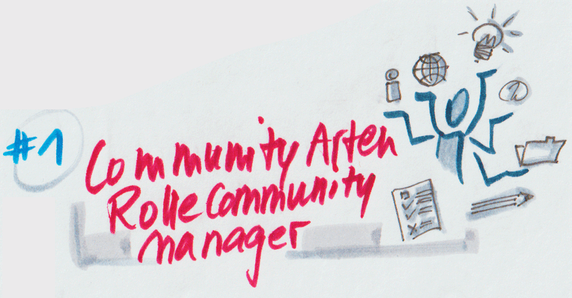
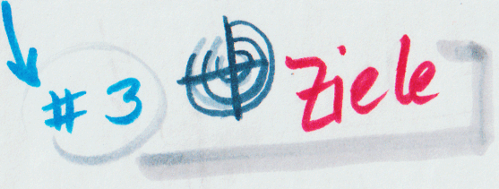
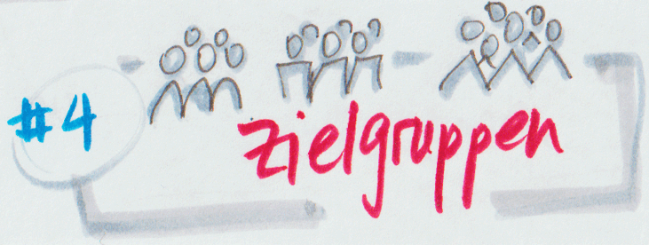
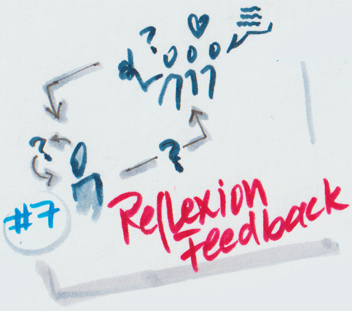
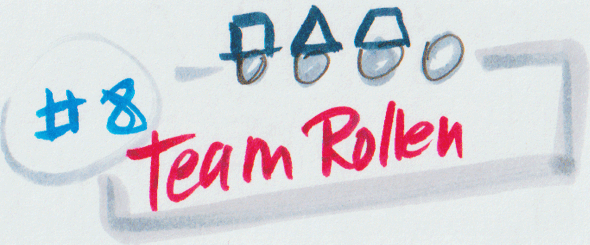
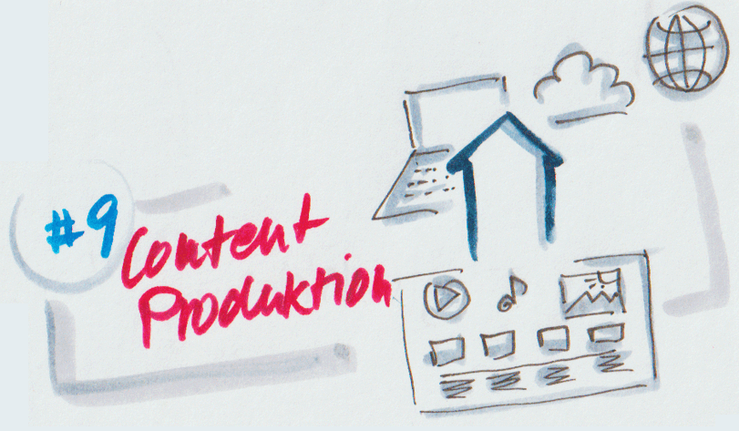
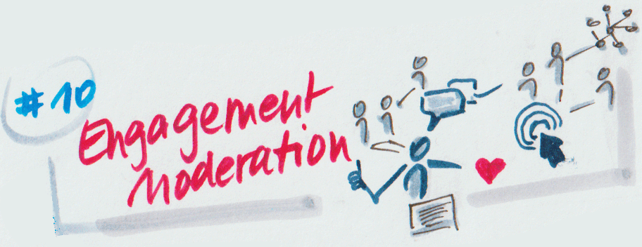
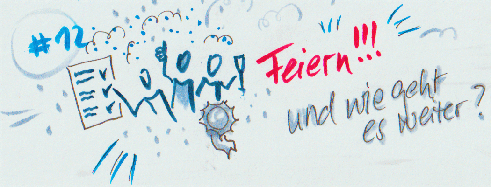

# Lernpfad

Dieser Lernpfad führt euch - wie in den anderen lernOS Guides - in zwölf
Wochen durch das Thema. Dabei baut ihr einerseits schrittweise Wissen
auf (“**Themen**”), andererseits bietet der Lernpfad auch konkrete
“**Aufgaben”**, damit ihr euer individuelles Community-Vorhaben von der
Pike auf entwickeln könnt.

Der Lernpfad hält sich kurz. Unter **“Themen”** erhaltet ihr Hinweise
auf Themen und Fragestellungen, denen ihr nachgehen könnt - aber keine
langen Ausführungen dazu. Um mehr zu erfahren, folgt den Verweisen auf
die ***Grundlagen***-Kapitel im ersten Teil, oder sogar
den “**Weiterführenden Vorschlägen**”, die in der Regel auf unser
[***Literaturverzeichnis***](6-00-Anhang.md) referieren.

Wichtig: Der Aufbau und das Betreiben einer Community ist nicht mit
einem Durchgang abgeschlossen. Nicht die Fertigstellung einer Plattform
zu einem festgesetzten Zeitpunkt ist das Ziel, sondern im Zentrum stehen
die Mitglieder und ihre sich entwickelnden Bedürfnisse. Schleifen und
Justierungen an verschiedenen Stellen des Community-Lebenszyklus lohnen
sich also. Um diesem Aspekt gerecht zu werden, gibt es in jeder Woche
auch einen Abschnitt “**Review und Reflexion**”, in dem ihr euch dazu
anregen lassen könnt, euch bestimmte Themen noch einmal vorzunehmen -
mit einer neuen Perspektive oder inzwischen erworbenem, neuem Wissen.

Die **Hilfsmittel**, auf die wir hier referieren, und die euch einen
roten Faden für die Konzeption geben können, sind der **Community
Canvas** und die **Party-Liste**, die beide im Abschnitt [***Community skizzieren***](4-02-Konzeption_und_Planung.md) näher beschrieben sind.

Aus diesem Grund ist sogar eine ganze Woche des Lernpfads der Rückschau
gewidmet: Abschnitt “**7 - Halbzeit-Reflexion und Feedback”**. (Falls ihr andere
lernOS Guides kennt: Dort gibt es Boxenstopps in den Wochen 4 und 8, die
ebenfalls der Reflexion dienen. Wir haben das für den lernOS Community
Management Guide angepasst und auf Woche 7 gebündelt.) Durch den
expliziten Verweis auf das Feedback von wichtigen Stakeholdern wollen
wir hier auch noch einmal darauf aufmerksam machen: Eine Community
entsteht nicht alleine, denn sie lebt am Ende nur gemeinsam. Nicht
zuletzt deshalb sprechen wir euch ja auch so an: Mit “ihr”!

So weit so gut. Vielleicht fragen sich an dieser Stelle einige von euch:
**Aber ich betreue doch bereits eine Community. Lohnt sich der Lernpfad
für mich dann überhaupt?** Wir würden sagen ja, denn die Erfahrung
zeigt, dass viele bereits aktive Community Managerinnen mit dem hier
gebotenen Rüstzeug und neuem Wissen ihre Community auf eine neue Stufe
heben konnten. Für euch ist der Lernpfad eine Gelegenheit, eure
bisherigen Ansätze und Maßnahmen einer Überprüfung zu unterziehen und
vielleicht neu auszurichten.

Dies bedeutet natürlich auch: **Der Lernpfad ist nur eine Anregung!**
Widmet euch den Themen, die für euer Vorhaben und eure gegenwärtigen
Lernziele am relevantesten erscheinen. Lasst die anderen links liegen.
Es spricht auch gar nichts dagegen, später darauf zurückzukommen.

Zu guter Letzt ist Community Management ein komplexes Thema. Je mehr ihr
euch damit beschäftigt, desto mehr dehnt sich die Zeit. Entscheidet euch
also mit eurem Lernzirkel:

1. bewusst für einen Schnelldurchlauf, mit harter Priorisierung, nach
   dem Motto “Touch the treadmill”, in tatsächlichen 12 Wochen.

2. Oder interpretiert eure Lern-Sprints freier: Gönnt euch einen
   passenden, z. B. vierzehntägigen Abstand zwischen den Wochen.

3. Oder aber wiederholt den Zirkel später, um euch ganz nach agiler
   Manier dem Thema in Schleifen immer weiter anzunähern!

Macht den Lernpfad zu eurem! Viel Spass damit!

## 

## 0 - Ankommen und Zirkel formieren

- Lernt einander kennen.

- Tauscht euch über eure Erwartungen an den gemeinsamen Lernzirkel aus
  und auch eure individuellen Lernziele.

- Vereinbart Vertraulichkeit: Schafft einen Raum für euch, in dem sich
  jeder wohlfühlt und angenommen wird. Alles was unter euch geteilt
  wird, bleibt bei euch.

- Einigt euch auf eine Plattform, zum Beispiel Microsoft Teams oder
  eine andere Plattform, die für euch alle funktioniert.

- Verbindlichkeit: Legt die Termine für die nächsten 12 Wochen fest -
  am besten mit wiederkehrender Zeit und Wochentag.

- Macht euch Gedanken, wer kann was gut und will was übernehmen, z. B.
  die Rolle der Zirkel-Moderatorin, die z.B. auch das Zeitmanagement
  der jeweiligen Session übernimmt.

- Tauscht eure Daten, wie E-Mail oder Handynummern aus, um einander im
  Notfall zu erreichen oder auch zwischen den Wochen zu treffen.

Hier findet ihr eine Checkliste zur
[<u>Zirkel-Moderation</u>](https://cogneon.github.io/lernos-for-you/de/3-Anhang/#circle-moderations-checkliste).

## 1 - Arten von Communities und Rolle von Community Managern

**Themen**

- Arten von Communities

- Rolle Community Manager: Kompetenz, Funktion, Mission

Zum Beispiel:

- Was ist eigentlich eine Community? ("Community" vs. Publikum vs.
  Netzwerk vs. Virtuelles Team)

- Bedeutung von Online-Communities und internen sozialen Netzwerken

- Communities im Spannungsfeld Top-Down / Bottom-up

- "Selbstführung": Lernziel: Definieren der eigenen Rolle &
  Ressourcen, Argumentieren gegenüber den Sponsoren

**Welche Kapitel des lernOS Guide kann ich dazu lesen?**

- [***Definitionen***](2-02-Definitionen.md)	

- [***Community-Rollen***](2-03-Community-Rollen.md)

- Abschnitt [***Anforderungen an das Community Management***](2-03-Community-Rollen.md)

- Abschnitt [***Klarheit über Community-Typ und treibende Kräfte gewinnen***](4-02-Konzeption_und_Planung.md)

**Aufgaben**

Macht eine Recherche: Welche Communities in eurem Unternehmen gibt es?
Sucht bewusst nach Online-Communities, aber auch nach
plattform-unabhängigen Communities in der breiteren Definition als
“Zusammenschluss von Menschen”.

Typisiert die Communities und redet mit den Community Manager\*innen
über das, was sie tun. Versucht ihre Tätigkeit zu beschreiben.

Wenn ihr wollt, fokussiert die Recherche auf Communities, die eurem
Community-Projekt inhaltlich nahestehen. So wird daraus eine kleine
Benchmarking-Analyse, die euch Anhaltspunkte für eure Positionierung und
mögliche Partnerschaften liefert!

**Review und Reflexion**

Der Aufbau deiner Community ist ein iterativer Prozess mit vielen
Schleifen. In diesem Abschnitt wollen wir dich in den nächsten Wochen
dazu anregen, unabhängig vom Wochenthema vorherige Stadien deiner Arbeit
noch einmal zu reflektieren und weiterzuentwickeln. Als Hilfsmittel
schlagen wir den Community Canvas sowie eine “Party-Liste” vor (siehe
  [***Community skizzieren***](4-02-Konzeption_und_Planung.md).

**Weiterführende Vorschläge**

Details findest du im [***Literaturverzeichnis***](6-00-Anhang.md).

- Top Quellen zu Community Management
  
  - Wenger, McDermott (2002): Cultivating Communities of Practice
  
  - Millington,(2012): Buzzing Communities
  
  - Bacon (2019): People Powered
  
  - Maturity Model / CRT
  
  - Definitionen und Rollenprofile des BVCM e.V.
    
    - Offizielle Definition Community Management (2010)
    
    - BVCM definiert Social Media Berufsbilder (2012)
    
    - Corporate Community Management - BVCM und Bosch stellen
      Entwurf des neuen Berufsbilds vor (2014)

- Für den Fokus "Zusammenarbeit":
  
  - Leadership vs. Management (angrenzende Themen: Value Creation in
    social learning spaces (Wenger: Learning to make a difference))
  
  - Virtuelle Teams führen & Hybrides Arbeiten

## 

## 2 - Konzeption

**Themen**

Strukturierungsansätze für das Konzept und die Entwicklung der Community

- Community Lifecycle (Idee, Konzept, Erste Umsetzung, Ramp-up,
  Go-Live, Betrieb & Wachstum, Beendigung)

- Grundlagen des Community-Konzepts (Ziele, Zielgruppe (Mitglieder),
  Strategie, Gestaltungsgrundsätze, Aktivitäten)

- Community Canvas

Diese Ansätze sind Hilfsangebote, keine Dogmen; du entscheidest, was
wichtig für dich ist. Dein Community-Konzept entwickelt sich iterativ
weiter!

**Welche Kapitel des lernOS Guide kann ich dazu lesen?**

- [***Community Lifecycle***](2-04-Community-Lifecycle.md)

- [***Als Team starten***](4-01-Als_Team_starten.md)	

- [***Hilfsmittel, um die Community zu skizzieren***](4-02-Konzeption_und_Planung.md)

- Abschnitt [***Einordnung der Community - warum braucht es euch und wem ähnelt
  ihr?***](4-02-Konzeption_und_Planung.md)

- Abschnitt [***Community-Strategie - Ziele, Zielgruppen und Daseinsgrund
  definieren***](4-02-Konzeption_und_Planung.md) (Verschaffe dir einen Überblick)

**Aufgaben**

Beginne die Arbeit an deinem Konzept auf Basis eines der vorgestellten
Templates.

Fülle den Canvas aus mit den Gedanken, die du aus deinem bisherigen
Wissensstand ziehst.

**Review und Reflexion**

- Nutzt den Community Canvas und den Input aus Woche 1, um den
  Anwendungsfall eurer Community zu schärfen. Welche Art von Community
  wollt ihr gründen? Welche Aktivitäten sollen dort stattfinden?

- Überlegt, welche wohlwollenden Menschen ihr in der Konzeptionsphase
  eurer Community einbeziehen könnt, um ein rundes Bild eurer
  Ausgangssituation sowie Feedback zu erhalten.

**Weiterführende Vorschläge**

- Staal (2021): The steps to getting your community off to a flying
  start

## 

## 3 - Ziele

**Themen**

Zielhorizonte

- Zielzustände definieren: Was hat sich in deinem Unternehmen oder
  deinem Umfeld verändert durch deine Community?

- Woran kann ich beurteilen, ob ich meine Ziele erreicht habe?

- In welchen Zeiträumen soll meine Community wo stehen?

Ziele verfeinern:

- Zielehierarchie (Strategisch ("Big Rocks"), Operativ, Messgrößen)

**Welche Kapitel des lernOS Guide kann ich dazu lesen?**

- Abschnitt [***Community-Strategie - Ziele, Zielgruppen und Daseinsgrund
  definieren***](4-02-Konzeption_und_Planung.md)

- Abschnitt [***Erfolgsmessung***](4-02-Konzeption_und_Planung.md)

**Aufgaben**

Mache dir Gedanken über deine Zielhorizonte (siehe oben).

Fülle im Canvas das Feld "Ziele" aus.

**Review und Reflexion**

- Reflektiert, ob der gewählte Community-Typ zu den Zielen passt oder
  wie ihr beides aufeinander abstimmt.

- Erstellt eine Rangfolge eurer Ziele, die ihr im Laufe des Prozesses
  heranziehen und neu evaluieren könnt, um euren Fokus zu schärfen.

**Weiterführende Vorschläge**

- OKR (Objectives & Key Results), SMART und ggf. weitere Systematiken
  für die Ziele-Definition, z.B. auf Wikipedia

- Community Roundtable (2013): State of Community Management:
  Benchmarks für Community-Engagement

## 

## 4 - Zielgruppen

**Themen**

Nachdem ihr in der letzten Woche eure Ziele definiert habt, lernt ihr
jetzt eure (zukünftigen) Mitglieder besser kennen. Denn Ziele sind gut,
aber nichts geht ohne die Mitglieder. Was erwarten sie? Wie könnt ihr
sie motivieren? Wie werden sie für euch überhaupt greifbar?

- Nicht dasselbe, Ausgleich gefragt: Erwartungen und Motivation
  (zukünftiger) Mitglieder versus Community-Ziele (oder sogar
  Sponsoren-Ziele)

- Die Mitglieder kennen lernen

- Personas - ein wichtiges Hilfsmittel, um Zielgruppen zu definieren
  und Aktivitäten daraus abzuleiten

**Welche Kapitel des lernOS Guide kann ich dazu lesen?**

- Abschnitt [***Community-Strategie: Ziele, Zielgruppen und Kernaussage definieren***](4-02-Konzeption_und_Planung.md)

- Abschnitt [***Hilfsmittel, um die Community zu skizzieren***](4-02-Konzeption_und_Planung.md) (Weitere
  Hinweise)

**Aufgaben**

- Erstellen von Personas für die eigene Community

- Fülle die Felder "Identität" und "Werte" im Canvas aus.

**Review und Reflexion**

- Schaut euch an, was ihr über eure Zielgruppe gelernt habt. Wie könnt
  ihr ihre Motivation wecken, um eure Ziele zu erreichen? Passen die
  Ziele und die Art der Community zu eurer Zielgruppe?

**Weiterführende Vorschläge**

Der Community Canvas enthält folgende Hinweise zum Thema Zielgruppen:

Für wen ist die Community? Welche Zielgruppe soll angesprochen werden?
Communities richten sich immer an spezielle Zielpersonen. Die Antwort
auf die Frage „für wen ist diese Community?“ lautet nie für alle gleich.

Fragen die in diesem Themengebiet gestellt werden können sind:

- Welche Charaktereigenschaften teilen die Mitglieder?

- Wie beschreibt die Community ihre Mitglieder?

- Wie lautet das Profil der aktivsten Mitglieder in der Community?

- Wie kümmert sich die Community um ihre Stammuser?

Literatur:

- Staal / Wagenaar (2020): Organizing Communities

- Pink (2011): Drive

- Bacon (2019): People powered

## 

## 5 - Inhalte und Aktivitäten

**Themen**

Worum dreht sich die Community? Was verbindet die, die daran teilnehmen?
Die Antworten auf diese Frage liegt in den Inhalten und Aktivitäten
eurer Community. Nachdem du dich mit Zielen und deinen Zielgruppen
beschäftigt hast, könnt ihr nun dazu passende Inhalte und Aktivitäten
entwickeln.

**Welche Kapitel des lernOS Guide kann ich dazu lesen?**

- [<u>Strategie-Cocktails</u>](\l)

- [<u>Community aktivieren und führen</u>](\l) (Verschaffe dir einen
  Überblick)

**Aufgaben**

- Passende Maßnahmen (Formate, Taktiken) zusammenstellen, die auf die
  Ziele der Community einzahlen

- Felder ("Inhalte", "geteilte Erfahrungen", "Rituale") im Canvas
  ausfüllen

**Review und Reflexion**

- Arbeite sauber heraus, inwiefern Aktivitäten und Inhalte einerseits
  die Motivation eurer Mitglieder ansprechen und andererseits zur
  Erreichung eurer Ziele beitragen.

- Schaut euch eure Eintragungen in den Feldern zur Identität im Canvas
  an. Passen Aktivitäten und Inhalte dazu?

**Weiterführende Vorschläge**

- Bacon (2019): People Powered

- Löffler, Michl (2019): Think Content!

- Weller / Harmanus (2021): Content Design

## 

## 6 - Technologien

**Themen**

In vielen Fällen steht für interne Communities eine Standard-Plattform
zur Verfügung, zum Beispiel ein Social Intranet oder ein internes
soziales Netzwerk. In diesem Fall ist es wichtig, dass ihr euch mit den
Funktionen und Rahmenbedingungen vertraut macht - und zwar nicht nur aus
eurer Community-Manager-Perspektive, sondern auch aus dem Blickwinkel
“normaler” Nutzerinnen.

Falls es keine Standard-Plattform für euch gibt, solltet ihr mit einem
Evaluierungsprozess starten, um die für eure Ziele und Zielgruppen
passende Technologie zu identifizieren.

- Community-Gestaltung

- Usability

- Technologien und Plattformen
  
  - Eigene Plattform vs. soziales Netzwerk wie Facebook Work etc.
  
  - Open Source
  
  - Software as a Service (LumApps, Coyo, Yammer, IBM Connect, Jive,
    Staffbase, …)
  
  - Eigenentwicklungen

- Unterschiede zwischen internen und externen Communities

- Communities können auch auf verschiedenen Kanälen (z.B.: Coyo +
  Teams + Newsletter) stattfinden (Eine Community ist immer eine
  Gruppe von Menschen, Technologie ist ein Tool)

**Welche Kapitel des lernOS Guide kann ich dazu lesen?**

Da sich das Feld der Technologien schnell wandelt, haben wir auf ein
eigenes Kapitel dazu verzichtet. Wichtig ist die externe, aktuelle
Recherche. Mehr dazu unter “Weiterführende Vorschläge”.

**Aufgaben**

- Recherche zu den Funktionsweisen und Optionen der verfügbaren
  Plattform (Social Intranet und ggf. weitere)

- Recherche zur Tool-Affinität der Zielgruppen

- Scribble für zentrale Seiten und eine Struktur der Community
  erstellen und erste Realisierung eines einfachen Prototypen &
  Feedback dazu einholen

**Review und Reflexion**

- Überlegt, inwiefern eure Zielgruppe gegenüber der von euch gewählten
  oder euch zur Verfügung stehenden Technologie affin ist. Gibt es
  ggf. Alternativen? Sind andere Maßnahmen nötig, um eine evtl.
  bestehende Lücke zu schließen?

**Weiterführende Vorschläge**

Die Technologien entwickeln sich ständig weiter, daher haben wir hier
auf konkrete Verweise verzichtet. Beschaffe dir Informationen von den
internen oder externen Technologie-Anbietern. Vernetze dich mit anderen
Anwendern, insbesondere Betreibenden oder Community-Manager\*innen.

- Richard Millington: Vergleich diverser Plattformen (Fokus auf
  externe Communities, dient aber als Inspiration für Kriterien):
  [Online Community Software and Platforms](https://www.feverbee.com/communityplatforms/)

- Gartner: Social Software in the Workplace Reviews and Ratings

- Staal / Wagenaar (2020): Organizing Communities

## 7 - Halbzeit-Reflexion mit Feedback

**Themen**

- Feedbackrunde: Geht zu relevanten Menschen (etwa Stakeholder oder
  gewogene Power-User) und lasst euch Feedback zu eurem Konzept geben.

**Welche Kapitel des lernOS Guide kann ich dazu lesen?**

Nutzt die Tipps in diesen Kapiteln, um Ansprechpartner zu
identifizieren:

- [<u>Community-Rollen</u>](\l)

- [<u>Als Team starten</u>](#als-team-starten)

- [<u>Klarheit über Community-Typ und treibende Kräfte
  gewinnen</u>](\l)

**Aufgaben**

- Verfeinert eure Zusammenstellung der Aktivitäten und Inhalte

**Review und Reflexion**

- Mache dir bewusst, was du bisher erreicht hast.

**Weiterführende Vorschläge**

Nutze deinen (vor-)ausgefüllten Community Canvas, um ihn mit
verschiedenen Interessensgruppen durchzusprechen.

Es empfehlen sich Methoden, die einen Perspektivwechsel in besonderem
Maße unterstützen. Zum Beispiel aus dem Design-Thinking-Prozess oder,
wie hier, aus der [Theorie-U-Community](https://www.presencing.org/resource/tools):

- Stakeholder Interview

- Empathy Walk (Listening)

## 

## 8 - Team und Rollen

**Themen**

Eine Community entwickelt man nicht allein. Bindet so früh wie möglich
andere in euren Entwicklungsprozess ein und zieht die Kreise der
Beteiligten und Input-Gebenden Zug um Zug größer. Beschäftigt euch in
dieser Woche mit diesem erweiterten Teambildungsprozess und lernt mehr
darüber wie ihr euch organisiert.

- Community-Team

- Partnerschaften

- Mithelfer

- Power-User

- Sponsoren und Stakeholder

**Welche Kapitel des lernOS Guide kann ich dazu lesen?**

- [<u>Community-Rollen</u>](\l)

- [<u>Als Team starten</u>](#als-team-starten)

- [<u>Klarheit über Community-Typ und treibende Kräfte
  gewinnen</u>](\l)

**Aufgaben**

Lege eine Liste der Rollen in deinem (erweiterten) Community-Team an.

Welche Fähigkeiten sind besetzt? Wer kann welche Fähigkeiten beisteuern?
Wer übernimmt welche Verantwortung?

**Review und Reflexion**

Reflektiert, inwiefern eure Ressourcen angemessen sind, um eure Ziele zu
erreichen. Ist eine Fokussierung oder ein anderer Zuschnitt
erforderlich?

**Weiterführende Vorschläge**

- Bacon (2019): People Powered

- Staal / Wagenaar (2020): Organizing Communities

## 

## 9 - Content-Produktion

**Themen**

Wie gestaltet ihr eure Inhalte? Die Möglichkeiten sind natürlich
vielfältig, und auch der Einsatz unterschiedlicher Medien wie Video oder
Podcast kann für eure Community interessant sein. Zentral sind aber
immer noch Texte und Bilder, und darauf konzentrieren wir uns diese
Woche.

- Content-Produktion (insbesondere Social Media / Online-Texte)

- Blog-Beitrag

- Storytelling

- Passende Hinweise z.B. aus "Aktivieren & Führen"

- Redaktionsplanung

**Welche Kapitel des lernOS Guide kann ich dazu lesen?**

Bitte beachtet die weiterführenden Vorschläge dazu.

Weitere Anregungen findet ihr ggf. in den lernOS Guides ePortfolio und
Content Curation (in Arbeit).

**Aufgaben**

- Blog-Beitrag erstellen und Feedback austauschen

**Review und Reflexion**

Nehmt euch eure Personas erneut vor. Überlegt, wie eure Aktivitäten und
Inhalte gestaltet sein müssen, damit eure Personas gerne damit
interagieren.

**Weiterführende Vorschläge**

- Gestaltung von Online-Texten (Google-Recherche)

- Storytelling, z.B.
  [https://onlinemarketing.de/cases/storytelling-formate-10-alternativen-heldenreise](https://onlinemarketing.de/cases/storytelling-formate-10-alternativen-heldenreise)

- Löffler, Michl (2019): Think Content!

- Weller / Harmanus (2021): Content Design

- Snowden et al. (2020) Cynefin

- Interview Stefan Diepolder im Podcast [Kuration von Lerninhalten in Organisationen - LernXP Podcast](https://lernxp.de/2021/09/22/kuration-von-lerninhalten/)

## 

## 10 - Engagement und Moderation

**Themen**

Interaktionen machen eine lebendige Community aus. Im Mittelpunkt stehen
dabei Kommentare und Gespräche. Diese Woche beschäftigt ihr euch damit,
wie eure Moderation beides unterstützt und am Leben erhält.

- Engagement-Maßnahmen

- Moderationstechniken

**Welche Kapitel des lernOS Guide kann ich dazu lesen?**

- [<u>Strategie-Cocktails</u>](\l)

- [<u>Community aktivieren und führen</u>](\l)**,** insbesondere
  [<u>Gastgeberin sein - den Raum gestalten</u>](\l)

- [<u>Community-Fallbeispiele</u>](\l)

**Aufgaben**

- Recherche von Best Practices

- Erfahrungsaustausch mit anderen Community Managerinnen

- Felder ("Inhalte", "geteilte Erfahrungen", "Rituale") im Canvas
  reviewen

- Netiquette erstellen

**Review und Reflexion**

- Reflektiert, wie ihr die Interaktivität eurer Aktivitäten und
  Inhalte weiter erhöhen könnt.

- Lassen sich aus den Personas interaktive Maßnahmen sowie
  Engagement-Treiber ableiten?

**Weiterführende Vorschläge**

- [Leseliste Community-Moderation](https://socialmediacollective.org/reading-lists/content-moderation-reading-list/)

- Jones / Vogel (2020): Building Brand Communities

## 11 - Schwierige Situationen

**Themen**

Die Aktivitäten in der Community flauen ab, der Ton wird rau, es gibt
Konflikte? Diese Woche beschäftigen wir uns mit Krisen der Community
oder einfach schwierigen Situationen, und wie ihr damit umgehen könnt.

- Krisen erkennen

- Moderation: Umgang mit Trollen, schwierigen Situationen

- Hinweis auf Netiquette

**Welche Kapitel des lernOS Guide kann ich dazu lesen?**

- [<u>Werte, Regeln und Verhaltenskodex</u>](\l)

- [<u>Community transformieren oder
  schließen</u>](#community-transformieren-oder-schließen)

**Aufgaben**

- Recherche von Rahmenregelungen der eigenen internen Plattformen, z.
  B. Social Media Guidelines, Konzernbetriebsvereinbarung

- Gemeinsame Diskussion und Analyse von Beispielen für schwierige
  Situationen

- Gemeinsames Rollenspiel Troll / Moderatorinnen anhand beispielhafter
  Beiträge als Vorlage für eigene Kommentare

**Review und Reflexion**

- Felder im Canvas ausfüllen oder reviewen: "Regeln", "Werte",
  "Identität"

**Weiterführende Vorschläge**

- Mai Thi Nguyen-Kim (2021): [Wir müssen reden](https://youtu.be/VaiwC1icfEY) (YouTube)

- [Heating Engagement in ESNs](https://www.youtube.com/watch?v=OzLnFyAO9h4&t=6s) - Fallbeispiel von Claudia Mayer
  (\#C3Managers, Juli 2021)

- [Debattenkultur: Warum die Deutsche Telekom sich neue
  Social-Media-Grundsätze gegeben hat](https://www.linkedin.com/pulse/debattenkultur-warum-die-deutsche-telekom-sich-neue-gegeben-h%C3%B6ttges/) (Tim Höttges, LinkedIn, 2019)

- [How to deal with negative app reviews and feedback](https://medium.com/swlh/how-to-deal-with-negative-app-reviews-and-feedback-a323cbd2972f). (Rajput
  Mehul, 2018)

## 12 - Feiern - und wie geht es weiter?

**Themen**

Ihr habt viel geschafft - jetzt ist Zeit zu feiern! Freut euch
gemeinsam, lasst eure Lern-Stationen Revue passieren und heckt Ideen für
die Zukunft aus!

**Welche Kapitel des lernOS Guide kann ich dazu lesen?**

- [<u>Community transformieren</u>](\l)

**Aufgaben**

- (Vorab) gemeinsame Liste offener Fragen erstellen, Input
  recherchieren und gemeinsam diskutieren

- Netzwerke von (internen) Community Managerinnen recherchieren und
  dort bzw. mit dem eigenen Circle einen fortgesetzten Austausch
  planen bzw. vereinbaren

**Review und Reflexion**

- Wie geht’s weiter

- Weiterentwicklungsmöglichkeiten

- Eure weitere Arbeit mit dem Canvas

- Durchlaufe den Lernpfad erneut, diesmal gezielt, um eure Community
  weiterzuentwickeln. Nutze z.B. die <u>Peerfinder-App</u>, um einen
  Lernzirkel zu gründen.

**Weiterführende Vorschläge**

- Überlegt euch, wie ihr selbst ein Netzwerk bilden könnt, um euch
  auch in Zukunft gegenseitig zu unterstützen.

- Stepper (2015): Working Out Loud
