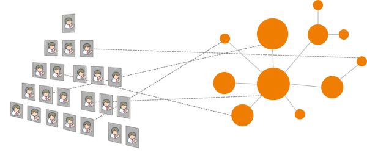
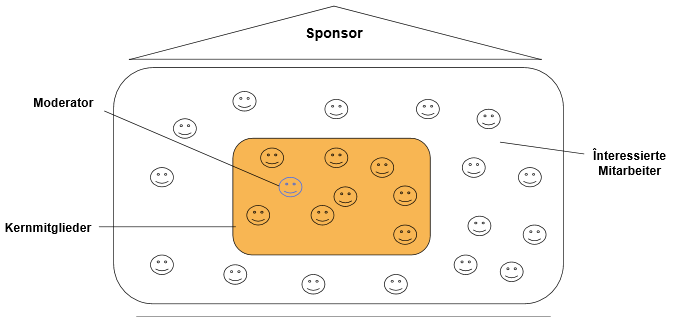

# Grundlagen
Viele Unternehmen sind heute als einfache oder mehrfache Hierarchie organisiert. Bekannte Modelle sind hierarchische Stab-Linien-Organisationen, überlagerte Projektorganisationen und Matrixorganisationen.

Da Wissen nicht hierarchisch sondern netzartig strukturiert ist, ergibt sich bei den genannten Organisationsformen das gleiche Problem, wie beim Zeichnen einer Landkarte: es entstehen Verfälschungen! Hierbei ist die Suche nach der “richtigen Hierarchie” nicht zielführend. Egal nach welcher Dimension strukturiert wird, es werden immer benötigte Informations- und- Wissensflüsse durchbrochen. Deswegen sagen führende Organisation- und Change-Management-Experten z.B.: „Hierarchies won‘t be replaced but rather extended by social technology enabled Communities“ (Dual Operating System, Prof. John P. Kotter) oder “Wir müssen Entscheidungshierarchien beibehalten, aber Informationshierarchien durch Informationsnetzwerke ersetzen (Prof. Michael Koch).

 

Das bedeutet in der Praxis, dass Mitarbeiter, die sich mit den gleichen Themen beschäftigen, in unterschiedlichen Abteilungen, Prozessen oder Standorten ansässig sind und der Wissensfluß dadurch behindert wird. Die Idee der “Community” kann hier Abhilfe schaffen. Indem Mitarbeiter mit gleichen Zielen und Themen regelmäßig interagieren können sie Wissen teilen und generieren, unabhängig von organisatorischer und geographischer Verortung. Die Interaktion in Communities kann hierbei in physischen Treffen oder virtuell geschehen.

Durch die Einführung sozialer Medien in Unternehmen in den letzten Jahren steht ein mächtiges Werkzeug für die Unterstützung von Community-Aktivitäten zur Verfügung. Moderne Enterprise Social Networks (ESN) bieten u.a. die Möglichkeit Online-Communities zu erstellen und dadurch Kommunikation und Vernetzung zu übergreifenden Themen zu flexibilisieren und zu beschleunigen.

## Definitionen

* **Community:** Communities sind Gruppen von Menschen, die ein gemeinsames Ziel haben und regelmäßig bzw. bei Bedarf interagieren, um ihr Ziel zu erreichen. “Eine Online Community ist zudem eine virtuelle, themenbasierte Arbeitsumgebung, die Teams mit gleichen Interessen und Aufgaben eine Heimat bieten kann. Hier kann mit verschiedenen Funktionen effizienter an einem Thema zusammengearbeitet werden, als klassisch per E-Mail. Alle Informationen sind zentral an einem Ort verfügbar und können überall von jedem Device bearbeitet werden.” (Katharina Perschke, Bosch)
* **Community Management:** Community Management ist die Bezeichnung für alle Methoden und Tätigkeiten rund um Konzeption, Aufbau, Leitung, Betrieb, Betreuung und Optimierung von virtuellen Gemeinschaften sowie deren Entsprechung außerhalb des virtuellen Raumes. Unterschieden wird dabei zwischen operativen, den direkten Kontakt mit den Mitgliedern betreffenden, und strategischen, den übergeordneten Rahmen betreffenden, Aufgaben und Fragestellungen (Quelle: [BVCM 05.2010](https://www.bvcm.org/2010/05/veroffentlichung-der-offiziellen-definition-community-management/)). Community Management ist die Bezeichnung für alle Methoden und Tätigkeiten rund um Planung, Start, Aktivierung, Führung und Transformation von Communities.
* **Community of Practice (CoP):** Communities of Practice (CoP) sind Gruppen von Personen, die Interesse oder Leidenschaft für eine Tätigkeit (Praxis) teilen und durch regelmäßige Interaktion lernen, diese Tätigkeit besser auszuführen (nach Wenger).

## Rollen in Communities
Communities können organisch und ohne festgelegte Rollen funktionieren. Viele Communities basieren auf Graswurzel-Bewegungen und der Partizipation von Freiwilligen. In der Praxis hat sich aber gezeigt, dass “Kümmerer” in Form bestimmter Rollen die Entwicklung von Communities positiv beeinflussen können. Wichtig ist, dass über die Definition von Rollen keine “Bürokratisierung” oder “Überformalisieurung” der Community entsteht und freie Interaktion möglich ist.

* Community Manager: ist für die Koordination von Planung, Start, Aktivierung, Führung und Transformation der Community zuständig. Die Rolle des Community Managers kann bei einer Person liegen oder auf mehrere Personen verteilt sein (Empfehlung: mindestens zwei, bei verteilten Communities ggf. zusätzlich lokale Community Manager). Community Manager sollten sich nicht als “Chef” der Community verstehen, sondern eher als “Gastgeber”. In der Praxis sind verschiedene Namen für die Community Manager Rolle gängig (z.B. Community Coordinator, Community Leader, Community Facilitator, Fachforum-Sprecher).
* Community Management Team (optional): Je nach Größe und Bedeutung einer Community kann es sinnvoll sein, die Aufgaben eines Community Managers auf mehreren Schultern zu verteilen. Dies ist besonders sinnvoll bei Communities rund um Fachthemen, bei denen der Community Manager nicht der Fach-Experte ist. Hier können sog. Subject Matter Experts (Deutsche Bank) - also Fach-Experten, mit ins Community Management Team aufgenommen werden. Darüber hinaus eignet sich sich die Erweiterung des Community Management Teams bei globalen Communities um lokale Vertreter, um lokale Bedürfnisse und besonderheiten berücksichtigen zu können (“Location Leader” - Deutsche Bank)
* Community Mitglieder: sind Mitarbeiter, die an den Interaktionen der Community teilnehmen. Dadurch erhalten sie selber Nutzen und/oder stiften Nutzen für andere. Die Mitglieder einer Community können je nach Aktivitätsgrad kategorisiert werden (z.B. Kernmitglieder, aktive Mitglieder, periphere Mitglieder/Lurker). Community Manager sollten nicht erwarten, dass 100% der Mitglieder einer Community aktive Mitglieder sind (s.a. 90:9:1-Regel).
* Management Sponsor: einflussreiche Person in der Organisation, die hinter dem Thema und den Zielen der Community steht. Management Sponsoren sind für die Legitimation der Community und die Verfügbarkeit von Ressourcen wichtig.
* Führungskräfte der Community Mitglieder: da die Mitgliedschaft in einer Community i.d.R. keine offizielle Rolle und auch nicht in der Zielvereinbarung enthalten ist, können die Führungskräfte der Community Mitglieder als deren “Sponsoren” betrachtet werden.

## Anforderungen an Community Manager
So vielfältig die Zwecke / Ziele  von Communities sein können, so können auch die Anforderungen stark variieren. Nichtsdestotrotz zeigt sich bei den meisten Communities, dass es ohne ein Engagement eines Community Managers kaum möglich ist, eine lebendige Community zu etablieren und zu führen. Hierbei sei noch besonders hervorgehoben, dass ein Community Manager nicht nur beim Start sondern insbesondere danach notwendig ist. Zum Verständnis ist hier vielleicht auch eine kleine Analogie sinnvoll. 

Stellen Sie sich vor Sie werden zu einer Gartenparty eingeladen. Soll ich überhaupt dort hingehen? Soll ich etwas mitbringen? Wer ist noch eingeladen? Kenne ich die Leute? Gibt es wohl Themen über die ich mich mit den anderen unterhalten kann? Soll ich mich bei der Party als “Grillmeister” einbringen? Kommen ihnen diese Fragen bekannt vor? Einen Teil der Fragen werden Sie als Community Manager direkt bei der Einladung oder bei einem kurzen Gespräch vorab klären können. Viele Fragen werden die Besucher aber auch während der Party haben. Daher sind Sie als Gastgeber insbesondere während der Party gefragt z.B. die Gäste untereinander in Kontakt zu bringen und ihnen möglichen zu bieten sich mit konkreten Dingen einzubringen (Musik machen, grillen, etc.). 

Als Community Manager bzw. Gastgeber müssen Sie somit gewisse Anforderungen mitbringen um ihrer Rolle gerecht zu werden. Eine gute Quelle für generelle Erfolgsfaktoren für erfolgreiches Community Management im beruflichen Kontext hat das Unternehmen [buw] digital zuletzt in ihrem Blog-Beitrag “Corporate Community Management - 10 Erfolgsfaktoren für Community Management im Enterprise 2.0” veröffentlich. Darin werden folgende Punkte hervorgehoben (Details zu den einzelnen Punkten, finden Sie im verlinkten Blog-Beitrag): Empathie, Serviceorientierte Denkart
Reaktionsgeschwindigkeit, Ängste nehmen, Evangelisieren, begeistern, vorleben, entertainen, Veranschaulichen und das Niveau treffen, Adaption von Prozessen, Kontinuität, Stringenz, Konsequenz und Kohärenz, Charmantes Nerven. Weitere Anforderungen in etwa sind:
Zuverlässigkeit, Initiativ, im Thema Zuhause, Teamplayer, freundlich.
Corporate Community Management Erfolgsfaktoren Infografik 

Quelle: http://buw-blog.de/corporate-community-management-10-erfolgsfaktoren-fur-community-management-im-enterprise-2-0/

Je nach Zweck und Ziel der Community können diese Anforderungen bzw. Erfolgsfaktoren aber auch stark variieren. Dies zeigen auch die Anforderungsprofile eines Community Managers des Bundesverbands für Community Management e.V. (BVCM). Aufgrund der vielzahl von möglich notwendigen Anforderungen an einen Community Managers kann es sinnvoll sein Einzelanforderungen in Rollen zu bündeln. Genau dies hat die Robert Bosch GmbH gemacht und folgende Rollen eines Corporate (internen) Community Manager definiert. Je nach Community Ziel und Zweck sind dabei auch die Schwerpunkte der Anforderungen an einen Community Manager unterschiedlich: Führungskraft, Stratege, Manager, Facilitator, Marketer, Gärtner, Berater, Unterhalter, Architekt, Content Manager, Wissens Manager, Motivator, Vermittler, Prozess Designer, Marken Botschafter, Projekt Manager, Netzwerker, Wächter, Redakteur, Analyst, Teilnehmer, Event Manager, Moderator, Konzepter. Bei der deutschen Telekom unterscheidet man in die Rollen  Inhaltsersteller, Moderator, “Lebenszirkel-Begleiter”, Administrator, Evaluator und Themenspezifischer Fachexperte.

Verschiedene Rollen eines Community Managers bei der Robert Bosch GmbH (Copyright Robert Bosch GmbH 2016. Alle Rechte vorbehalten, auch bzgl. jeder Verfügung, Verwertung, Reproduktion, Bearbeitung, Weitergabe sowie für den Fall von Schutzrechtsanmeldungen)
http://socialconnections.info/sessions/the-importance-of-community-based-collaboration-for-robert-bosch-gmbh/

Übertragen auf unser Beispiel der Gartenparty würden Sie als Gastgeber hauptsächlich in der Rollen des Unterhalters, Vermittlers, Netzwerkers, Teilnehmers und Moderators agieren.

## Community Lifecycle
Planung, Start, Aktivierung, Führung und Transformation von Communities lässt sich nicht als linearer Prozess mit klar definiertem Anfang und Ende darstellen. Ähnlich der Entwicklung im Projektmanagement in Form des Übergangs von linearen Modellen zu iterativen Modellen, lassen sich auch beim Community Management Phasen benennen, die in Iterationen durchlaufen werden. Diese Phasen werden in den folgenden Kapitel drei bis fünf im Detail beschrieben:

Aufgabe: Community Lifecycle visualisieren (Simon)

Der Community Lifecycle der Robert Bosch GmbH (Copyright Robert Bosch GmbH 2016. Alle Rechte vorbehalten, auch bzgl. jeder Verfügung, Verwertung, Reproduktion, Bearbeitung, Weitergabe sowie für den Fall von Schutzrechtsanmeldungen)
http://socialconnections.info/sessions/the-importance-of-community-based-collaboration-for-robert-bosch-gmbh/ 

## Community Toolkit

1. Ask Me Anything (AMA)
2. Blogparade
3. Community Call
4. Meetup
5. Podcast
6. Videokonferenz
7. Wissenslandkarte
8. Working Out Loud (WOL)

## Fallbeispiele

Aufgabe: Einleitungstext zur Auswahl der Communities mit Nennung von Typen ohne Anspruch auf Vollständigkeit. Klären, welche der Communities im Playbook gelistet werden dürfen, für diese Name und Kurzbeschreibung (2-3 Zeilen), wenn vorhanden Visualisierung (Foto, Screenshot) und weiterführende Informationen (wenn vorhanden). Communities, die wir ins Playbook aufnehmen, fett markieren und Ansprechpartner dazu schreiben.

Anwendungsfälle in Communities (in Einleitungstext integrieren)
1. Neue Ideen finden
2. Informationen kommunizieren bzw. streuen
3. Unterstützung bei Problemen und Fragen bekommen
4. Meetings und Treffen organisieren
5. Experten finden
6. Optionen und Ideen gemeinsam bewerten
7. Informationen sammeln und kombinieren (Innovation)
8. Im Projekt kommunizieren
9. Aufgaben transparent organisieren
10. Inhalte filtern
11. Veränderungsprojekte anstoßen
12. Onboarding neuer Mitarbeiter unterstützen
13. Vernetzung fördern

### GUIDE Network (Continental)
Austauschplattform des globalen GUIDE Netzwerks mit FAQ, mehrsprachige Trainings, Engagement und Coordination "all in one"

### Podcast Community (sendegate.de) 

Name: …

Geschichte: … wie war die Ausgangssituation, wie wurde die Community initialisiert, welche Barrieren gab es, welche Erfolge gibt es (max. viertel Seite Text) …

Weiterführende Informationen: … optional, z.B. Links auf Internetquellen, Bücher, Vorträge, Videos etc. …

### Working Out Loud Community (Bosch) 

Name: Working Out Loud @ Bosch

Geschichte:  WOL-Community_1.jpg 
Die Working Out Loud (WOL) @ Bosch Community wurde im Juli 2015 auf unserem internen ESN “Bosch Connect” (basiert auf IBM Connections) gegründet und hat bis heute bereits > 450 Mitglieder. Sie ist öffentlich und somit für jeden Bosch Mitarbeiter frei zugänglich. Hier finden sich alle Informationen rund um das Working Out Loud und dazugehörige Circle Konzept von John Stepper (www.workingoutloud.com). Auch die Circles (Lerngruppen von 4-5 Personen) finden sich hier selbstorganisiert zusammen und organisieren sich in Sub-Communities. Diese sind allerdings geschlossen, um die Privatshäre der Circles zu schützen. Die wichtigsten Inhalte werden in zwei Sprachen angeboten, in deutscher sowie englischer Sprache, wobei in den Circle Sub-Communities selbstverständlich auch andere Sprachen zulässig sind.
Ziel der Community ist es, die Methode “Working Out Loud” (Working Out Loud = transparente, offene, netzwerk- und damit resonanzbasierte Arbeitsweise) bei Bosch zu implementieren und alle Interessenten unter einem Dach (der Community) zu vereinen.  Ein Team aus sechs Corporate Community Managern, natürlich WOL-Enthusiasten der ersten Stunde, unterstützt selbstorganisiert und auf freiwilliger Basis die dort laufenden Aktivitäten. Hauptsächlich werden in der Community die folgenden Funktionen genutzt:

* Blog: zur Information über Neuigkeiten aus der WOL-Welt (intern und extern), Rückmeldungen aus Circlen etc.
* Forum: Beantwortung von Fragen, Organisation der Circles (an einem Circle teilnehmen bzw. einen Circle moderieren)
* Wiki: Informationen zur WOL Methode und des Circle Konzepts sowie alle Inhalte, die im Circle benötigt werden (Circle Guides, Vorlagen etc.), Übersicht über alle Bosch Circles
* Lesezeichen: Links zu den wichtigsten externen WOL Adressen
* Neuigkeiten: kurze Ankündigungen über WOL Aktivitäten

Neue Mitglieder werden täglich ganz persönlich begrüßt. Sie erhalten neben einem persönlichen Willkommensgruß einen Link auf eine “Willkommens-Seite”, die Ihnen einen Überblick über die Community gibt und bei den ersten Schritten unterstützt. Dies hilft, sie in das bestehende Netzwerk zu integrieren und aus der technischen Komponente “Community” auch eine starke soziale Gemeinschaft zu entwickeln, die das Thema “Working Out Loud” bei Bosch vorantreibt. Dies kann nur durch aktives Vorleben und persönliche Erfolgsgeschichten der Nutzer gelingen, da ist sich das Community Manager Team sicher. Und die Methode von “Working Out Loud”, dem netzwerkbasierten Arbeiten, wird im digitalen Zeitalter zu einer wichtigen Fähigkeit für das Unternehmen.

Weiterführende Informationen:
* www.workingoutloud.com
* www.workingoutloud.de
* www.wolweek.wordpress.com
* https://www.bvcm.org/2015/12/working-out-loud-wol-eine-wichtige-methode-fuer-interne-corporate-community-manager/
* www.managerseminare.de/pdf/tt10.pdf

### Weitere Fallbeispiele

* Airbus - Weber, Frithjof et al. (2007): Wissensmanagement? Im Flug erobert.  Wissensmanagement Heft 8 / 2007. URL: http://home.arcor.de/frithjof.weber/download/Weber_etal_2007_Wissensmanagement__WM%20im%20Flug_erobert.pdf, abgerufen 02.03.2015
* Alcoa in APQC (2010): The Positioning Communities of Practice for Success - An APQC Collaborative Benchmarking Report.
* BASF - Chin, Dr. Chew; Wolf, Marlene (2013): connect.BASF - Creating chemistry with an Online Business Network. URL: http://de.slideshare.net/basf/connect-basf-onlinebusinessnetwork 
* Bosch - Perschke, K. / Göhring, M. (2015): Berufsbild Interner Community Manager.URL: http://de.slideshare.net/martinagoehring/knowtech2014-goehring-perschke abgerufen am 17.02.2016
* Bosch - Perschke, K./Koch, B. (2015): The importance of community-based collaboration for Robert Bosch GmbH. URL: http://socialconnections.info/sessions/the-importance-of-community-based-collaboration-for-robert-bosch-gmbh/ abgerufen am 17.02.2016
* Cisco (2012): Community Management Playbook 2013. URL: http://de.slideshare.net/Cisco/cisco-communities-playbook-2013, abgerufen am 27.02.2015
* ConocoPhilips (2010) - 2010 MAKE Finalist - Case Study. URL: http://www.aiim.org/documents/chapters/southwest/AIIM_SWChapter_17Feb2011_DanRanta_2010%20COP%20case%20study.pdf, abgerufen am 10.04.2015
* ConocoPhilips - Ranta, Dan (2013): Power of Connections at ConocoPhillips. URL: http://de.slideshare.net/SIKM/dan-ranta-power-of-connections-at-conocophillips, abgerufen am 29.05.2015
* Daimler Chrysler - Karboul, Amel (2002): Die Tech Clubs von Daimler Chrysler. URL: http://www.symposion.de/wissen_kapitel08940101_WERK0970.html, abgerufen am 02.03.2015
* Deutsche Telekom - Schildknecht, Martina; Holst, Marcus (2011): Communities of Practice funktioniert! - Beispiel der Telekom Knowledge Management Community. Knowtech 2011.
* Ernst & Young in APQC (2010): The Positioning Communities of Practice for Success - An APQC Collaborative Benchmarking Report.
* Festo - Martin Kimmich (2011) - Überblick Festo Wissensmanagement. GFWM Regionaltreffen. URL: http://archiv.gfwm.de/files/groups/files/20110713%20GfWM@Festo%20external%20version_0.pdf, abgerufen am 27.02.2015
* Semco - Sempler, Ricardo (2000): How We Went Digital Without a Strategy. Harvard Business Review. URL: http://www.pdfdrive.net/how-we-went-digital-without-a-strategy-resourceful-humans-e5048924.html, abgerufen am 03.06.2015
* Semco - Fenton World Dynamics (2002): Semco: A vision for the future?. URL: http://lambtonhat.weebly.com/uploads/4/4/1/3/4413567/semco_a_vision_of_the_future_.pdf, abgerufen am 03.06.2015
* Siemens - Becker, Lothar, Müller, Micha (2011): Experten-Communities als Steuerungsinstrument für eine globale Enterprise 2.0 Initiative. Knowtech 2011. URL: http://www.knowtech-community.de/files/documents/F1-02_Becker_Mueller_Siemens.pdf, abgerufen am 20.05.2015
* Siemens - Stocker, Alexander; Müller, Johannes (2013): Exploring Factual and Perceived Use and Benefits of a Web 2.0-based Knowledge Management Application. The Case References+. I-Know 2013. URL: http://de.slideshare.net/stockera/exploring-factual-and-perceived, abgerufen am 20.05.2015
* Siemens - Heiss, Michael Prof. Dr. (2010): Social Media and ROI: Why use-cases are more compelling than Excel sheets; RIP 4 ROI, URL: http://de.slideshare.net/heisss/rip4-roi-siemens-heiss, abgerufen am 19.06.2015
* Schaeffler - Seren, Paul (2014): Networks of Competence bei Schaeffler.  Cogneon Management 2.0 Lerntag "Internes Community Management. URL: https://www.youtube.com/watch?v=ir0MGxcKk3E, abgerufen am 27.02.2015
* Schaeffler - Willi, Kurt-Jürgen (2006) - Wissensmanagement in der Schaeffler Gruppe, GFWM Stammtisch Mittelfranken am 09.02.2006, URL: http://archiv.gfwm.de/files/GfWM-Stammtisch%20Mittelfranken%20-%202006-02-09%20-%20WM%20in%20der%20Schaeffler%20Gruppe.pdf, abgerufen am 23.04.2015
* ThyssenKrupp - Schnauffer, Hans-Georg (2010): Wissensmanagement bei ThyssenKrupp - Mit Communities of Experts WIssenspotentiale erschließen. Knowtech 2010. URL: http://de.slideshare.net/simon.dueckert/vortrag-thyssenkrupp-cogneon-knowtech-2010, abgerufen am 27.02.2015
* Schlumberger in APQC (2010): The Positioning Communities of Practice for Success - An APQC Collaborative Benchmarking Report.
* Swisscom (2013): Der Customer Centricity Score. Ein KPI für Kundenzentrierung. URL: http://de.slideshare.net/designfokus/customer-centricity-score, abgerufen am 28.05.2015
* UBS - Stoller-Schai, Dr. Daniel (2011): Community Building bei der UBS AG - "Communities ohne Management funktionieren nicht". Knowtech 2011. URL: http://de.slideshare.net/dstoller/community-building-bei-der-ubs-ag-communities-ohne-management-funktionieren-nicht-9501216?qid=e06ba35d-aaca-499c-b02d-49e3c3ae0c8d&v=default&b=&from_search=6, abgerufen am 08.06.2015.

## Weiterführende Informationen

**Bücher:**

* Bacon, Jono (2009): The Art of Community - Building the New Age of Participation. O*Reilly Media
* Dueck, Gunter (2013): Das Neue und seine Feinde. Campus Verlag.
* Gröscho, Steffi et al. (2015): Willkommen in der neuen Arbeitswelt - So erwecken Sie ein Social Intranet zum Leben. School of Communication and Management
* Hansen, Morton (2009): Collaboration: How Leaders Avoid the Traps, Create Unity, and Reap Big Results. Harvard Business School Publishing
* Hofstede, Geert (2001): Culture's Consequences: Comparing Values, Behaviors, Institutions and Organizations Across Nations, 2. Auflage, Thousand Oaks CA: Sage Publications
* Hubert, Cindy; O*Dell, Carla (2011): The New Edge in Knowledge - How Knowledge Management is Changing the Way we do Business. John Wiley & Sons
* Kotter, John (1996): Leading Change. Harvard Business Press.
* Lesser, Eric L. et al. (2000), Knowledge and Communities. Butterworth-Heinemann
* Millington, Richard (2012): Buzzing Communities - How to Build Bigger, Better, and More Active Online Communities
* Romhardt, Kai (2002): Wissensgemeinschaften - Orte lebendigen Wissensmanagements. Versus Verlag
* Lembke, Gerald (2005): Wissenskooperation in Wissensgemeinschaften, LearnAct! Verlagsgesellschaft
* Orr, Julian (1996): Talking about Machines - An Ethnography of a Modern Job. Cornell University Press
* Pein, Vivian (2014): Der Social Media Manager: Das Handbuch für Ausbildung und Beruf. Galileo Press
* Pink Daniel (2011): Drive: The Surprising Truth About What Motivates Us. Riverhead Books
* Senge, Peter (1999): The Dance of Change - The Challenges of sustaining momentum in Learning Organizations. Nicholas Brealey Publishing
* Schein, Edgar (2004): Organizational Culture and Leadership.
* Schleuter, Willibert (2009): Die sieben Irrtümer des Change Managements und wie Sie sie vermeiden. Campus Verlag.
* Stepper, John (2015): Working Out Loud. For a better career and life.
* Wenger, Etienne (1998): Communities of Practice - Learning, Meaning and Identity. Cambridge University Press
* Wenger, Etienne:; Lave, J. (1991): Situated Learning: Legitimate Peripheral Participation. Cambridge University Press
* Wenger. E.; McDermott, Richard; Snyder, William M. (2002): Cultivating communities of practice. Harvard Business School Press

**Paper/Studien:**

* APQC (2010): The Positioning Communities of Practice for Success - An APQC Collaborative Benchmarking Report.
* BVCM - Ellermann, B. (2014): Corporate Community Management – BVCM und BOSCH stellen Entwurf des neuen Berufsbilds vor. URL: https://www.bvcm.org/2014/03/corporate-community-management-bvcm-und-bosch-stellen-entwurf-des-neuen-berufsbilds-vor/ abgerufen am 16.02.2016
* BVCM - Langwasser, D. (2010): Veröffentlichung der offiziellen Definition Community Management. URL: https://www.bvcm.org/2010/05/veroffentlichung-der-offiziellen-definition-community-management/ abgerufen am 16.02.2016
* BVCM - Gust, B. (2012): BVCM definiert Social Media Berufsbilder. URL: http://www.bvcm.org/2012/07/bvcm-definiert-social-media-berufsbilder/ abgerufen am 16.02.2016
* Community Roundtable (2014): The State of Community Management 2014. URL: http://de.slideshare.net/rhappe/the-state-of-community-management-2014 ,abgerufen am 27.02.2015
* Community Roundtable (2015): Defining Community Management Roles. URL:  http://www.slideshare.net/rhappe/defining-community-management-roles, abgerufen am 27.02.2015
* Community Roundtable (2014): Community Manager Salary Survey 2014. URL: http://www.communityroundtable.com/research/community-manager-salary-survey/cmss-2014/, abgerufen am 27.02.2015
* Community Roundtable (2015): Community Manager Handbook. 20 Lessons from Community superheroes. URL: http://de.slideshare.net/rhappe/community-manager-handbook-by-the-community-roundtable, abgerufen am 13.04.2015
* Community Roundtable (2015): The State of Community Management 2015. URL: http://de.slideshare.net/rhappe/the-state-of-community-managerment-2015, abgerufen am 08.06.2015
* Community Roundtable (2015): How to Measure, Benchmark and Calculate Community ROI. URL: http://de.slideshare.net/rhappe/community-benchmarking-and-roi, abgerufen am 03.06.2015
* Cialdini, Robert (2013): The Uses and Abuses of Influence. Harvard Business Review. July-August 2013. URL: https://enterprisersproject.com/sites/default/files/The%20Uses%20and%20Abuses%20of%20Influence.pdf, abgerufen am 28.05.2015
* Herzog et al. (2014): Barrieren der Erfolgsmessung von Enterprise Social Software. Vorgestellt auf der Multikonferenz Wirtschaftsinformatik 2014. URL: http://www.google.de/url?sa=t&rct=j&q=&esrc=s&source=web&cd=2&cad=rja&uact=8&ved=0CCYQFjAB&url=http%3A%2F%2Fwww.zora.uzh.ch%2F99283%2F1%2FHerzog%2520et%2520al%2520MKWI%25202014%2520Barrieren%2520Erfolgsmessung.pdf&ei=KjJcVfiFGMv9ULSqgfAF&usg=AFQjCNG8oLD_m7gO1PBrtM-rHrRZiR027A&bvm=bv.93756505,d.bGQ, abgerufen am 20.05.2015
* Hofstede, Geert (2006): Cultural influences on knowledge sharing through online communities of practice, Journal of knowledge management 2006.
* Kavanaugh et al. (2005) - Weak Ties in Networked Communities. The Information Society: An International Journal. URL: http://www.iisi.de/fileadmin/IISI/upload/C_T/2003/kavanaugh.pdf, abgerufen am 13.04.2015
* Kotter, John (2012) - Accelerate!. Harvard Business Review November 2012. URL: https://hbr.org/2012/11/accelerate, abgerufen am 28.04.2015
* Kotter, John; Schlesinger, Leonard (2008) - Choosing strategies for Change. Harvard Business Review July-August 2008. URL: https://globalleadershipfoundation.com/assets/files/2013/04/Choosing-strategies-for-change-KOTTER.pdf, abgerufen am 28.04.2015
* Kotter, John (2008): Leading Change: Why Transformation Efforts Fail. harvard Business Review January 2007 - Best of HBR. URL: http://www.lssu.edu/sharedgovernance/planningbudget/documents/LeadingChangeKotter.pdf, abgerufen am 28.05.2015
* Lindemann, Udo; Schön, Stefan (2001): Gestaltung und Unterstützung von CoPs. Reihe Produktentwicklung der TU München. Herbert Utz Verlag.
* Lok, Corie (2012): Career development: What*s your type?  Nature 488, 545-547. URL: http://www.nature.com/naturejobs/science/articles/10.1038/nj7412-545a, abgerufen am 28.07.2015
* McDermott, Richard (2002): Measuring the Impact of Communities. Knowledge Management Review Vol.5 Issue 2. URL: https://www.k4health.org/sites/default/files/Measuring%20the%20Impact%20of%20Communities.pdf, abgerufen am 26.02.2015
* McDermott, Richard; Archibald, Douglas (2010): Harnessing Your Staff’s Informal Networks. Harvard Business Review March 2010. URL:http://fisher.osu.edu/supplements/10/5481/Harnessing%20Your%20Staff%27s%20Informal%20Networks%20-%20HBR%20-%20February%202010.pdf, abgerufen am 10.04.2015
* McKinsey (2013): McKinsey global survey results evolution of the networked enterprise. URL:http://de.slideshare.net/fred.zimny/mc-kinsey-global-survey-results-evolution-of-the-networked-enterprise, abgerufen am 20.05.2015
* Niemeier, Joachim (2014): Leading the Transformation and Change Process. Enterprise 2.0 Summit 2014. URL: http://de.slideshare.net/JNiemeier/enterprise-20-summit-leading-the-transformation-and-change-process, abgerufen am 28.05.2015
* North, Klaus; Franz, Michael; Lembke, Gerald (2004): Wissenserzeugung und -Austausch in Wissensgemeinschaften Communities of Practice, QUEM-report, Heft 85
* Pleil, Thomas (2013): Positionspapier Kommunikation 2.0. URL: http://de.slideshare.net/apalme2003/mooc-thomaspleilpositionspapierkommunikation20, abgerufen am 03.06.2015
* PwC (2014): A perspective on Organizational Culture. URL: http://www.strategyand.pwc.com/media/file/Strategyand-Perspective-on-Organizational-Culture.pdf, abgerufen am 03.06.2015
* Richter et al. (2013): Success Measurement of Enterprise Social Networks. In: Proceedings 11th International Conference on Wirtschaftsinformatik, Leipzig. URL: http://www.kooperationssysteme.de/docs/pubs/Richter%20et%20al%202013_WI2013_Success_Measurement_of_ESN.pdf, abgerufen am 20.05.2015
* Richter et al. (2014): Erfolgsmessung von Enterprise Social Software: Wer? Was? Wie? URL: http://www.kooperationssysteme.de/wp-content/cache/mendeley-file-cache/e610c81d-166d-3750-9a9b-a9d7836c7033.pdf, abgerufen am 20.05.2015
* Rossi, Karsten (2013): Positionspapier Kommunikation 2.0. URL:http://de.scribd.com/doc/177695646/Carsten-Rossi-Positionspapier-Kommunikaton-2-0, abgerufen am 03.06.2015
* Schleuter, Dr. Willibert (2013): Change Management als Revolution von unten. URL: http://www.bbdk.de/vortraege-achiv.html?file=files/bbdk/dokumente/fruehjahrskolloquium/vortraege_2013/Vortrag_Schleuter.pdf, abgerufen am 28.05.2015
* Wang, Sheng; Noe, Raymond A. (2009): Knowledge sharing: A review and directions for future research. Human Resource Management Review. URL: http://web.iaincirebon.ac.id/ebook/indrya/Inovasi/HR_Managament.pdf, abgerufen am 02.03.2015
* Wenger, Etienne; Snyder William M. (2000) - Communities of Practice: The Organizational Frontier. Harvard Business Review. January Issue. URL: https://hbr.org/2000/01/communities-of-practice-the-organizational-frontier, abgerufen am 02.03.2015

# Lernpfad

## Community planen und starten

### Ziele, Zielgruppen und Nutzen definieren
Eine Community sollte selbstverständlich nicht zum Selbstzweck aufgesetzt werden, sondern bestimmte Ziele erreichen, die optimalerweise mit den Motivationen der Zielgruppen übereinstimmen und ihnen einen praktischen Nutzen bieten. Die zentrale Frage nach der Motivation, dem “What’s in it for me”, also was bringt es sowohl dem Auftraggeber/Sponsor wie dem Unternehmen oder einem Bereich, wie auch den einzelnen Zielgruppen wie z.B. konkrete Mitarbeiter, muss für alle Beteiligten geklärten werden. Dafür ist es notwendig, die Bedürfnisse und Rahmenbedingungen seiner Zielgruppe möglichst genau zu kennen um zielgerichtete Maßnahmen planen zu können.

Idealerweise werden drei bis fünf Ziele definiert, mit jeweils kurzfristigen, mittelfristigen und langfristigen Metriken zur Überprüfung der Zielerreichung. Die Ziele sollten von den Unternehmenszielen bzw. der Unternehmensstrategie abgeleitet werden.

Mögliche Ziele einer Community sind z.B. 

* Verbesserung der internen Zusammenarbeit durch community-basierte Arbeit und Nutzung verschiedener Funktionen innerhalb der Community 
* Verbesserung von internen Prozessen
* Unterstützung von Projekten und Projektmanagement
* Verbesserung des Informationsflusses der Mitglieder
* Transparenz in Diskussionen und Abstimmungen
* Innovationsmanagement durch gemeinsame Generierung, Bewertung und Diskussion von Themen
* Effizientere Organisation von Meetings und Veranstaltungen
* Selbstorganisierte Aufgabenverteilung
* Generierung und Diskussion neuer Ideen
* Austausch und Dokumentation von Wissen (Ziel: Verbesserung Wissensmanagement))

Je klarer das Ziel der Community definiert wird, desto einfacher wird es, alle Beteiligten für diese Idee zu gewinnen. Vor allem, wenn mit der Community ein bestehendes Problem gelöst wird oder Prozesse sich dadurch vereinfachen lassen. Für Klarheit sorgt hier eine Analyse der Ist-Situation, die sich der Frage widmet: Wie machen wir es heute und was möchten wir verbessern? Hieraus ergibt sich fast von selbst das Thema der Community sowie die Zielgruppe, d.h. diejenigen, die für das Thema benötigt werden. Oscar Berg hat für diese Analyse das sogenannte “Digital Collaboration Canvas” entwickelt (http://www.oscarberg.net/2015/04/introducing-digital-collaboration-canvas.html), welches eine einfache und gut strukturierte Vorgehensweise bietet. Eine weitere Vorlage für die Ziel-, Zielgruppen- und Nutzendefinition sowie für die Community Skizzierung (nächstes Kapitel) ist der Community Canvas.

Die Analyse sollte falls möglich mit der gesamten primären Zielgruppe gemeinsam gemacht werden. Je mehr und je früher die späteren Mitglieder in die Konzeption der Community aktiv eingebunden werden, mit desto mehr Verantwortung in das Gelingen ist zu rechnen. Auch der Nutzen, den die Community bringen soll, wird hierbei für alle klarer.

Was ist Output und wie messe ich Erfolg? Hierfür ist es notwendig die oben genannten Ziele zu operationalisieren, d.h. messbar zu machen. Hierfür müssen die entsprechenden Erfolgskriterien definiert werden. Hierbei wird sich zeigen, dass nicht alle auf direktem Wege messbar sind, ggf. müssen Hilfskonstrukte erstellt oder mit qualitativen Größen gearbeitet werden. Hierbei ist es sinnvoll, die vorhandenen Metriken der Plattform zu nutzen und vorhandene oder massgeschneiderte KPIs der Communities untereinander zu vergleichen.

Genau wie bei den Zielen muss auch bei den dadurch abgeleiteten Erfolgskriterien zwischen kurz- und langfristigen Betrachtungszeiträumen unterschieden werden. Genauso ist es wichtig, die langfristigen Ziele einer Community nicht mit den konkreten Zielen der einzelnen Maßnahmen zu verwechseln, die die Erreichung dieser langfristigen Zielen unterstützen sollen.

Kurzfristige Erfolgskriterien bzgl. der Ziele könnten hierbei sein:

* Durchlaufzeit eines Prozesses
* Reduzierung E-Mail Aufkommen zu einem Thema, welches jetzt community-basiert läuft
* Verbesserung des Wissensstandes innerhalb von Teams
* Vermeidung von Doppelarbeit und Fehlern
* Zeitersparnis beim Onboarding von neuen Mitarbeitern

Langfristige Erfolgskriterien bzgl. der Ziele sind z.B.: 

* Innovationsstärke/Geschwindigkeit
* Kostensenkungen (Datenvolumen; durch Ideen Kosten sparen, Bsp. Energieeffizienz)
* Unternehmenskultur verändert sich zu mehr Offenheit, Transparenz-, Dialog- und Feedback-Kultur

Folgende Metriken beziehen sich auf die Erfolgsmessung von konkreten Maßnahmen: 
* Wie viele Mitglieder?
* Wie viele Inhalte?
* Wie viele Diskussionen?
* Wieviel Fluktuation?
* Response-Zeiten auf Anfragen?
* Ganzheitlichkeit von Rückmeldungen (Querschnitt der Organisation)
* Diversität - Meinungsbilder
* Net Promoter Score / 
* Geschwindigkeit

### Die Community skizzieren 

Unabhängig von der Größe der angestrebten oder bereits existierenden Community sind die oben genannten Elemente wie Ziele, Zielgruppen und Erfolgskriterien zu beachten. Je nach Größe, strategischer Relevanz und Ausgangssituation/Hitnergrund bedingen diese Themen aber einen größeren Umfang an Vorbereitung und Abstimmung  und müssen entsprechend skaliert werden. 

Intrinsisch motiviert:

* einzelne Person möchte eine Community gründen, z.B. jemand, der erkennt, dass ein bestimmtes Thema einen strategischen Stellenwert hat und sucht nach Möglichkeiten, das Thema im Unternehmen voranzubringen.
* bestehende Gruppierung möchte sich einen formaleren Rahmen geben, z.B. tauschen sich Wissensmanagement-Interessierte bei gelegentlichen Treffen und Mittagessen austauschen. Sie sehen den Bedarf, mehr Kollegen für das Thema zu begeistern und gemeinsam einen Methodenkoffer zu entwickeln oder ähnliches und wollen daher ihrer Gruppe als Community einen formaleren Rahmen geben.
* eine neue Gruppe entsteht durch äußere Umstände (vgl. Selbsthilfegruppe), z.B. Ein Unternehmen stellt auf agile Vorgehensweisen um. Dadurch entstehen neue Rollen. Diejenigen, die diese Rolle ausfüllen sollen, haben noch wenig Erfahrung und wollen sich untereinander austauschen und miteinander lernen.
* ein verstreutes Team möchte effizienter kommunizieren und zusammenarbeiten. Community-basierte Arbeit ermöglicht asynchrones Arbeiten von jedem Ort und jedem Device aus (mit Zugriff auf das Unternehmensnetzwerk)

Extrinsisch motiviert:

* Eine entsprechende Stelle (Management) entscheidet, dass es zur Erreichung der Unternehmensziele notwendig oder hilfreich ist, eine Community z.B. zu einem strategisch wichtigen Thema zu gründen. Unterschied zu oben: Diese Person/Stelle wird nicht selbst Teil der Community. Erfüllt nicht alle klassischen Kriterien einer Community (Freiwilligkeitsaspekt), kommt aber in der Realität oft vor.

Voraussetzung

* Es gibt jemanden, der die Aufgaben des Community Managers übernimmt
* Community gibt es noch nicht. (International - Landessprache - gleiche doch sinnvoll?
* Core-Group (eine kleine Gruppe) ist interessiert mitzumachen)

Je nach Ausgangssituation und Zielen wird auch die Ramp-up-Phase der Community unterschiedlich gestaltet werden. 
Inhaltlich müssen gleiche Themen geklärt werden.
Daher unterscheiden wir im Folgenden das Ramp-up je nach Größenordnung und Typ.

Bring deine Idee zu Papier. 
Kernaussage der Community in 1-2 Sätzen formulieren. Diese dienen für alle folgenden Schritte als Leitbild. Natürlich kann das Leitbild bzw. diese Kernaussage in den nächsten Schritten ausgebaut und angepasst werden[d].

Finde ein Team: initiale Beratergruppe
Gemeinsam gestalten sich manche Sachen einfach besser. Sollte es an diesem Punkt schon schwer fallen einige Kollegen für das Thema zu finden, könnte man die initiale Idee / Motivation noch mal überdenken.

Einordnung der Community - Sicherstellung des Alleinstellungsmerkmals

* Kernaussage der Community in 1-2 Sätzen formulieren. Diese dienen für alle folgenden Schritte als Leitbild.
* Gibt es schon eine Community zu diesem Thema? Wenn ja, ist es hilfreicher keine zweite Community zu eröffnen sondern eher mit den verantwortlichen Kollegen in Kontakt zu treten und das Thema gemeinsam anzugehen.
* Passenden Namen für die Community finden (Gruppenname schon vorhanden? Kernaussage direkt erkennbar? 1.”Verkaufschance!”
* Welche bestehenden Kommunikationskanäle beschäftigen sich mit dem Thema der geplanten Community?
* Gibt es Kollegen, welche mit diesem Thema in Verbindung gebracht werden? 
* Ressourcen / Budget, (Wo)Manpower, Zeit
* Wo ist das Thema organisatorisch aufgehängt? Wer könnte zukünftig “Sponsor” sein, um Unterstützung im Management zu haben?
* Why? (Zweck) (Frage  ausformulieren)
* Who? (Wer nimmt teil? Wer wäre zusätzlich hilfreich? Wen möchte man noch gewinnen? Wer übernimmt welche Rollen? Gibt es einen Vertreter für den Community Manager? Welche Stakeholder gibt es und wie kann man sie abholen / überzeugen? Idee: Falls die Stakeholder (noch) nicht persönlich bekannt sind, kann man mit Personas arbeiten.)
* What? (Was soll erreicht werden, welche Ergebnisse sollen erarbeitet werden? Ziele?)
* How? (Wie möchte sich die Community organisieren? Wie möchte sie zusammenarbeiten? Welche Infrastruktur benötigt sie? Regelmeetings? Kommunikation? PR? Wie aktiviere ich Community Members)
* Woran messen wir, ob wir mit der Community erfolgreich sind? (KPIs)

Diese Punkte fließen ein in einen Community Steckbrief/Profile/Charter.
### Einen Fahrplan aufsetzen

Der Fahrplan erleichtert den Übergang von der Planung in den Launch:

* Sponsorship sichern (falls benötigt)
* Wann ist der Beste Zeitpunkt die Mitglieder in die Community zu holen (Pre-Test mit kleiner Gruppe, Pilot, Waves, oder gemeinsam starten oder ab welchem “Füllstand” / Strukturierungsstand?)
* Kontinuierliches Engagement Konzept planen
* Plattform aussuchen
* Initiales Set-up der Community
* Erstellung eines Redaktionsplans (Vorlage) mit 90-Tage-Pipeline
* Ressourcenaufwand: Ableitend aus dem Redaktionsplan bzw. des allgemeinen Fahrplans der Community
* Ideen für Aktionen, die in den Fahrplan aufgenommen werden können (konkret: Wer? Wann? Wo?)
* Launch-Kommunikation
* KickOff: physisch oder virtuell oder im Rahmen eines geplanten Events: Townhall, Mitarbeiterveranstaltung; bei größeren Communities erfolgt ein Kick-off erst nach einer umfangreicheren Planungsphase. Bei kleineren Communities ist der Kick-off der Startpunkt, an dem Ziele und Nutzen definiert werden.
* MOOC
* BarCamp
* Crowdsourcing
* Stammtisch
*  2015-08-04 15_32_15-Deutsche Telekom.png Frage-, Meinungsbild-, Blog der Woche

### Als Team starten

Beim Community Start gibt es die wichtigste Aufgabe des Community Managers. Er sollte eine Kerngruppe bzw. erste Mitstreiter finden und diese aktiv in die Gestaltung der Community mit einbeziehen. Durch die aktive Teilnahme mehrerer Community Mitgliedern wird den anderen Mitgliedern sowie Interessierte signalisiert, dass eine Beteiligung erwünscht ist. Damit wird die Hemmschwelle für alle weiteren Community Mitglieder gesenkt selber aktiver teilzunehmen. 

Je mehr Mitglieder aktiv werden desto geringer wird die Hemmschwelle – und nicht nur dass – sind sehr viele Mitglieder aktiv so entsteht auch ein gewisser sozialer Druck für “Noch nicht Aktive” selber aktiv zu werden. Dieses Verhalten rührt aus der Motivation des Menschen Teil einer sozialen Gruppe zu sein. Das folgende Youtube Video zeigt genau diesen Sachverhalt am Beispiel eines Mannes, der zunächst unorthodox allein auf der Wiese tanzt, die Situation sich allerdings schnell ändert nachdem ein paar weitere Personen mitmachen. Sehen Sie selbst: https://www.youtube.com/watch?v=fW8amMCVAJQ

Je nach Art und Größe der Community kann es sinnvoll sein ein physisch Kick-Off mit den ersten Mitstreitern, Mitgliedern und/oder Interessenten durchzuführen. Dabei sollte man das Community Konzept vorstellen und ggf. überarbeiten sowie  die virtuelle Infrastruktur und deren Möglichkeiten erklären und aufzeigen. Schließlich  sollte man klare Rollen und Verantwortlichkeiten für die Erledigung von Aufgaben im Betrieb einer Community definieren. Hier kann es sinnvoll einzelne Aufgaben oder ganze Aufgabenpakete zu delegieren (z.B. an die ersten Mitstreiter).

## Community aktivieren und führen 

### Beispiele für konkrete Aktivitäten und Formate

* Neuigkeiten verfolgen
* Was gibt es Neues innerhalb der Community (Menschen)
* Was gibt es Neues im thematischen Umfeld (Kooperieren, Konsolidieren…) - Silos verhindern - nach außen richten!!
* Kenne, verlinke (auch geistig) und tausche Dich aus mit artverwandten Communities (Impulsgeber, Social Learning)
* Gastgeber sein (dafür sorgen, das jeder alles hat) direkte! Reaktionen geben und Feedback schreiben / Wertschätzung ausdrücken liken / Weiterleiten/geben Sharen / Vernetzen / Menschen und Themen zusammenbringen
* Diskussionen “begleiten” zum Thema zurückführen, Entgleisungen moderieren, neu anregen, Faden aufnehmen, Diskussionen teilen (vernetzen), neue Impulse holen, Rückfragen stellen, Themen beenden 
* Rituale Stellen Sie sich vor, der Wochenmarkt ist wahlweise immer an einem anderen Tag... Durch Rituale schaffen Sie eine Regelmäßigkeit in Ihrer Community. Das erleichtert nicht nur die Arbeit des Community-Managers, was neue Impulse und Inhalte angeht sondern schafft auch eine positive Erwartungshaltung bei Ihren Mitgliedern.

Wertschätzung der Mitglieder und Bewusstsein für Community-Entwicklung schaffen.
Durch das vielleicht 1000. Mitglied in Ihrer Community haben Sie ein Ziel erreicht, was ohne die Mitglieder und genau dieses einzelne Mitglied so nicht möglich wäre - bedanken Sie sich hierfür. Begrüßen Sie neue Mitglieder und verabschieden Sie sie auch wieder - Stellen Sie an die Verabschiedung eine Warum? Frage an, um Ihre Community stetig zu verbessern.

* 100. te Mitglied
* beste Artikel
* Interview des Monats
* Mitarbeiter der Woche
* Bild des Tages
* Begrüßung
* Mitglied der Woche
* Begrüßung
* Verabschiedung
* Follow Friday
* Spruch der Woche “Leadership is…” (Motivation, Diskussion, Aufrüttler)
* Das Rad nicht neu erfinden: Alte Beiträge und Diskussionen wiederbeleben.   - kein “Drang nach Neuem” Beiträge und Diskussionen, deren Inhalte weiterhin relevant für die Community sind ,werden häufig durch die Flut neuer Beiträge nach “Hinten” gedrängt. Durch die Aktualisierung  des Beitrags, wird er im Verlauf wieder nach oben gespült. Vielleicht gibt es neue Entwicklungen im gleichen Thema, für die sich nicht gleich ein neuer Artikel lohnt, der sich aber als Ergänzung im bereits Geschriebenen gut macht. Das würdigt zudem den ursprünglichen Autor, wenn du seine Inhalte für längere Zeit wertvoll machst.

Beispiele: 

* “Das war vor einem Jahr” - einzelner Artikel
* Jahres- Monatsrückblick - Sammlung / Konsolidierung
* Beiträge über die man “stolpert” und wieder relevant sein sollten referenzieren.
* Bilder aus vergangenen Veranstaltungen als Teaser für kommende Events, Abfragen ob ältere Beiträge noch relevant sind?

* Begrüßung von neuen Mitgliedern
* Regelmäßig neue Mitglieder (ideal persönlich/einzeln) abholen = Begrüßung! Entweder direkt in der Community (z.B. über Status Updates) oder an dessen persönlichem Profil (manchen ist es in der Community too much).

Beispieltext:
Hallo xyz, schön dass Du zu uns gefunden hast, herzlich willkommen in unserem Netzwerk und unserer Community. Damit Du Dich schnell bei uns zurecht findest, haben wir hier eine “Welcome Page*” (mit Link!) eingerichtet. Falls Du Fragen hast, bitte melde Dich gerne direkt bei mir oder bei uns in unserem Forum. Viel Spass, wir freuen uns auf den Austausch mit Dir, Deine xyz
*Welcome Page: “Worum gehts? wer moderiert? Links zur technischen Hilfe, was findet man hier?...

* Vertreterregelung als Chance: Sicherstellung von Abwesenheit kann auch genutzt werden um “frischen Wind” und erweitertes Commitment zu erzeugen. Ausschreibung: wer möchte mich vertreten / wer möchte mal Community Manager sein / wer möchte sich mal ausprobieren … (Anzahl der Vertreter abhängig von Grüße, Thema und Aktivität der Community)
* siehe hier Ausschreibung bei Bosch:

* Vertreter überbieten siche (who is best, who performs best, who has greatest idea in his weeks)
* Community Management ausprobieren für begrenzten Zeitraum
* neue bringen ihre Netzwerke mit -> Community wächst
* Sichtbarkeit der Vertretung erhöht sich deutlich -> Recognition!
* Mit Zertifikat wertschätzen (oft nicht notwendig)
* Vertreter wird langhaltig aktives Mitglied
* Netzwerk rückt enger zusammen
* Idee übertragbar und skalierbar auf alle anderen Communities
* fördert Eigenmotivation und Selbstorganisation der Mitglieder
* zeigt Hilfsbereitschaft der Mitglieder
* Spotlight on Interview: Kurz Interviews von Community Mitgliedern um sich besser kennen zu lernen und ein Team zu werden, Wiki Seite (Template) mit einem Set an gemeinsamen Fragen und dem Profilfoto, Beispiel:  Dein Karriereweg, Was ich an meinem Job besonders mag, Meine besonderen Herausforderungen, Ein typischer Tagesablauf - je nach technischen Möglichkeiten Audio Podcast oder sogar Video
* Medienübergreifend platzieren: Hashtag macht Kollegen neugierig - deshalb vorab Tweets mit Hashtag auf zentral verfügbaren Medien kommunizieren, dann zu übergreifenden Themen und Events verwenden - um medienübergreifende Beteiligung sicherzustellen.
* “Animierende” Beiträge schreiben (mit Aufforderung, kontroversem Statement oder Frage): “Erzähl-Artikel” oder reine Fachartikel wirken schnell “abgeschlossen” oder bei zu fachlicher Sprache abschreckend (man traut sich nicht kommentieren um sich nicht zu blamieren), während Fragen oder kontroverse Aussagen zur Reaktion auffordern
Beiträge beginnen “In meinen Augen”, “aus unserer Erfahrung”, “...das braucht keiner!?” und beenden mit “Wie seht Ihr das?”
* Kommunikationskonzept / Redaktionsplan: Redaktionsplan mit wiederkehrenden Themen (wird planbarer - Vorsorge für die Not + Kontext Radar “ad hoc Neues/Spannendes”): Kernteam auswählen, dass hier mit Beiträgen unterstützt (wer welches Thema treibt oder über Expertenwissen verfügt sollte klar sein), zusätzlich regelmäßig abfragen, wer zu welchen Veranstaltungen geht und etwas zusammenfassendes beitragen kann; Es sollte 1-2x pro Woche etwas vom Kernteam erscheinen, damit Aktivität sichtbar ist. Beiträge des Kernteams bzw. wiederkehrende Inhalte können auch grafisch von Gastbeiträgen abgegrenzt werden, z.B. mit einem speziellen Header; für Projektteams oder collaborativ arbeitende Communities empfehlen wir einen sog. “Status-of-the-Week”, d.h. eine Zusammenfassung der Ereignisse der Woche (welche Themen, Aufgaben, Events, Entscheidungen etc.)
* ”Huch, was passiert hier?”:  Provokation - Kritische Fragen stellen - Statements, die Mitglieder herausfordern. Stell dir vor du liest die Überschrift “Hitzefrei für alle Abteilungen!” freust du dich schon und du willst wissen, ob auch du einfach nach Hause gehen kannst? Ziel erreicht. Sicher wirst du meinen Beitrag lesen. Übertreibungen, bewusste Lügen (die im Beitrag aufgeklärt werden), konfrontierende Fragen in der Überschrift wecken bei nahezu jedem Leser die Neugier, die es braucht, sich Zeit für den Post zu nehmen.
* Fragen - Fragen - Fragen über Fragen: Fragen (jeder kann mitreden oder sehr konvers); Blog Posts gerne mit direkten Fragen abschließen, evtl. mit einem Link versehen, der aufs Forum führt; wenn Community bereits aktiv ist gerne “provokante” oder “spezielle” Fragen im Forum posten, wie z.B. “Verdienen wir genug?”, “wer wehrt sich gegen Wandel und warum”, “was fällt Euch zu dieser Idee zu xyz (z.B. interner Prozessverbesserung, neues Gericht in der Kantine etc.) ein”... 
* Klare Aufforderung welche Reaktion gewünscht ist: Jeder Beitrag soll abgeschlossen werden mit einer Aufforderung zur gewünschten Reaktion Beispiel: Liken, Frage beantworten, persönliche Meinung “Schreiben Sie uns doch Ihre Meinung als Kommentar oder bestätigen Sie den Artikel durch klicken von LIKE
* Gastbeiträge aus anderen Communities: Gastbeiträge schreiben / anfragen Frische Ideen, Themen oder neue Sichtweisen ergeben schnell durch neue Beteiligte, zudem sind Gastbeiträge gutes Marketing Perspektivenwechsel - Kundensicht, andere Funktionen schildern Erlebnisse, Fachleute erklären Sachverhalte oder Prozesse
* Meinungsbilder - transparente Abstimmung: (Umfragen / Polls / Gamification … wenn möglich, erlaubt und passend   = Beteiligung - zB wenn die Community aufgehübscht werden soll (Mitgestaltung der Mitglieder), es Events gibt wer teilnimmt, Meinungsabfrage zu aktuell diskutierten Themen, die Bedeutung des “I like” Buttons, neue Ideen zu einem bestimmten Thema, Terminabfragen (3 Termine anbieten, Mehrheit entscheidet)
* Expert Talks: Ask me anything-Session VIP beantwortent Fragen (sog. Inhalt: regelmäßiger Live Chat über die Forum-Funktion. Wird ca. 3-4 Wochen im Vorraus angekündigt und immer wieder kommuniziert. Chat-Partner sind entweder neue Mitglieder mit spannendem Hintergrund o. Aufgabe, Expertenwissen oder Führungsfunktion - alternativ ein Expertenteam zu einem speziellen Thema. Innerhalb einer vorgegebenen Zeit (1 Stunde) ist das Forum offen und die Community Mitglieder können live Fragen stellen, die in Echtzeit beantwortet werden. Das macht Spass, schult die Mitglieder und schafft eine enge Vernetzung
* Statistiken zeigen: Oft ist Mitgliedern nicht bewußt, wie groß die Reichweite oder der Erfolg Ihrer Arbeit ist - durch zeigen der Zugriffszahlen, KPIs rechtfertigt sich der Aufwand leichter Anschauliche Diagramme im Blog, Steigerungsraten oder Zugriffszahlen, Zahl der Neuzugänge, eventuell (wo erlaubt/vorhanden) Aktivitätenindex

### Mitglieder akquirieren,unterstützen und moderieren 

1. Nachdem Sie die Community aufgesetzt haben, müssen Sie zunächst Mitglieder eingeladen. Dazu können Sie bei einer Online Community entsprechend Mitarbeiter berechtigen oder einladen. Darüber hinaus macht es Sinn die Community in Meetings vorzustellen.
2. Gerade in Communities, bei denen sich die Mitglieder noch nicht persönlich kennen, sollte man die Vorstellung neuer Mitglieder ermöglichen. Wenn es ein Kick-Off gibt, wäre dies ein guter Anlass. In einer Online Community würde man eine Diskussion anlegen und neue Mitglieder würden sich als Antwort dort vorstellen.
3. Oft gefordert und genauso häufig vernachlässigt – die Wertschätzung von aktiven Mitgliedern. Gerade bei übergreifenden Interessens Communities sollte man aktiven Mitgliedern würdigen indem man z.B. einen Kommentar veröffentlicht oder aber durch eine Gefällt Mir Angabe.
4. In Online Communities kann es auch einmal passieren, dass es zu hitzigen Diskussionen und fragwürdigen Beiträgen kommt. Ihre Aufgabe ist es dabei aufkommende Konflikte und Probleme zu schlichten sowie für die Einhaltung von Nutzungsbedingungen und Community Regeln zu sorgen. Hierbei sollte man den persönlichen Kontakt einer “öffentlichen Anprangerung” vorziehen.
5. Wenn Sie eine Online Community als den Ort für die Kommunikation der Community etablieren wollen, sollten Sie gerade in der Anfangszeit darauf achten, dass auf Fragen von Mitgliedern eine schnelle Antwort gegeben wird. Ansonsten greifen Mitgliedern auf Email und Telefon zurück.
6. Soziale Medien im unternehmensinternen Einsatz sind für die meisten Mitarbeiter noch Neuland. Möchte man diese Medien für eine Community nutzen, sollte man den Mitgliedern bei der Nutzung helfen und ihnen die Funktionalitäten und Wirkmechanismen aufzeigen. Trainingen und Websessions anbieten für verschiedene Levels und Zielgruppen.
7. Wichtig sind auch gemeinsame Spielregeln: wie wollen wir in unserer Community zusammenarbeiten? Welche Sprachen lassen wir zu? Wo findet sich was und welche Funktionen benutzen wir wofür? Auch der “I like” Button kann mit einer anderen Funktion versehen werden, er kann z.B. als Lesebestätigung dienen oder als Zustimmung

### Inhalte erstellen und Interaktionen anregen (Regel-Kommunikation etablieren)

Welche Arten von Inhalt erwarte ich in der Community und mit welchen technischen Mitteln kann ich diese Abbilden?

1. Arbeiten Sie gemeinsam mit den Community Mitglieder an Dokumenten – Je nach Community Typ könnte es sich dabei um Agenda und Protokolle, Themensammlungen, Status Berichte, Handbücher, Erfahrungsberichte, Handbücher, Leitfäden etc. handeln.
2. Publizieren Sie als Community Manager interessante und relevante Informationen für ihre Zielgruppe bzw. Mitglieder. Hierbei kann es sinnvoll sein mit Videos, Podcasts, innovativen Präsentationsformaten (z.B. Prezi), RSS-Feeds und Bildern in Texten zu arbeiten.
3. Gerade bei neuen Communities ist es sinnvoll eine breite Partizipation der Mitglieder mit Hilfe von kurzen Umfragen / Polls die Meinung und Sichtweisen von Mitgliedern abzufragen. Die von ihnen vor-definierten Antwortmöglichkeiten ermöglichen eine schnelle Beteiligung der Mitglieder.
4. In großen Community kann es sehr viele Aktivitäten. Mitglieder sind häufig nicht an allen beteiligt. Daher ist es hilfreich in bestimmten Zeitabständen zusammenfassende Blog Beiträge zu schreiben um die jüngsten Aktivitäten zu rekapitulieren (Aktivitäten, Treffen).
5. Möchten Sie lebhafte Diskussionen der Mitglieder initiieren? Dann formulieren Sie Diskussionen als Frage und die Mitglieder werden sich beteiligen. Hierbei ist ein Mix aus Fragen zu Lösungen für ein Problem, Meinungen zu einem Thema und Erfahrungen zu einem Sachverhalt hilfreich.
6. Moderne Corporate Social Networks ermöglichen die Sammlung, Bewertung und Erstellung von Rangfolgen eingebrachter Ideen. die Anwendungsgebiete sind vielfältig – z.B. Verbesserungsvorschläge, Vorschläge für weiteres Vorgehen, Vorschläge für Weihnachtsfeier-Location, Workshop Themen etc.

### Community Events durchführen

An dieser Stelle wird deutlich, dass eine Community mehr darstellt als ein Austausch in einer virtuellen Online-Community. Menschen leben und arbeiten gemeinsam im physischen Raum und als Community Manager sollte man Mitgliedern die Möglichkeit bieten sich physisch kennenzulernen und zu vernetzen. Denn ein auf Freiwilligkeit basierender Austausch setzt ein gewisses Maß an Vertrauen unter den Community Mitgliedern voraus. Dieses lässt sich am besten aufbauen wenn man sich persönlich kennenlernt. Community Events sind darüber hinaus sinnvoll um komplexe Themen diskutieren zu können, die nicht einfach in Schrift expliziert werden können. 

In solchen Situationen Bedarf es eines persönlichen Gesprächs.Generell sollte man ebenfalls versuchen die Online Community mit physischen Events zu koppeln, z.B. vorab Themensammlung erstellen und im Nachgang eine Fotodokumentation und einen Bericht/ ein Protokoll in der Online Community bereitstellen. Communities leben von der aktiven Teilnehmern vieler Mitglieder. Daher sollte man wenn möglich auch kollaborative Klein- und/oder Großgruppen-Formate in Betracht ziehen. Hier ein paar Beispiele für solche Formate:

1. Ask me anything Session
2. BarCamp
3. Hackathon
4. Open Space
5. Workshops
6. World Cafe

### Community bekannt machen
Je nach Community Typ möchte man mehr oder weniger Mitglieder in seiner Community haben. Die einfachste und zugleich wichtigste Maßnahme um seine Community bekannt zu machen ist die Online-Community offen zu lassen. Ist die Online-Community offen, so können Interessenten sie in der Liste aller Communities sehen. In der Praxis sind leider die meisten Online-Communities für Interessenten sogar unsichtbar. Neben dieser Einstellung der Community Art, sollte man darüber hinaus zwei Punkte verfolgen wenn man seine Community bekannt machen möchte:

Ein sehr gute Strategie um seine Community nur bekannt sondern auch legitimiert zu machen ist es dass Management als Unterstützer ihrer Community zu positionieren. Dies hat zum eine Signalwirkung auf Interessenten (Community ist gewollt), zum anderen können Führungskräfte je nach Ebene mit ihrer Kommunikationsreichweite und –Bedeutung ihre Community “bewerben”.

Kommunizieren Sie über Aktivitäten ihrer Community und über Erfolgsgeschichten und Nutzen Beispiele ihrer Community auf unterschiedlichen Kommunikationswegen. Präsentieren sie z.B. ihre Community in Meetings, schreiben sie einen Beitrag in einem Newsletter der Unternehmens-kommunikation, nutzen Sie bestehende Emailverteiler um auf sich aufmerksam zu machen - z.B. mit ein einem Community Steckbrief. Weitere Möglichkeiten: Veranstaltungen mit Externen, Sichtbare Wertschätzung (Urkunden - “Pimp my Desk” - interne Signatur), Same Tribe - “Zusammengehörigkeitsgefühl aufbauen, erzeugen, - ideal nach Außen sichtbar, offener Stammtisch, Selbstmarketing (Kanäle: Mitarbeiterzeitschrift, Intranet, T-Shirt (je nach Größe der Community) Vernetzen mit ähnlichen Communities, Menschen)

### Spezifische Regeln der Community

(Konkrete Community-interne Verabredungen zu Abläufen und Kommunikation / Zusammenarbeit / Feedback (hervorheben - Box… z.. Community Philosophie)

* Ihr könnt mit einer Reaktion auf Fragen und Hinweise innerhalb von 24 Stunden unter der Woche rechnen
* Klare Regeln gemeinsam formulieren - und gegebenenfalls anpassen (Konkret: Wie stimme ich zu? wie schnell erwarten wir Reaktionen? Welche Sprache? Grußformel ja/nein? welche Kanäle werden wofür genutzt? Ausreden lassen, Meinungen sagen dürfen, Seltsame Reaktionen aufnehmen, Was wenn keine Reaktion) ...Beispiele!
* Beispiele Kata:
* Wie kommunizieren hier auf Deutsch und Englisch
* Jeder darf hier seine Meinung offen vertreten gemäß Netiquette und den Bosch WeErten. Wir kritisieren nicht und geben uns nur konstruktives Feedback
* Wir schreiben hier ohne Anrede und Grußformel offen und direkt
* Rechtschreibfehler im Wiki werden von allen verbessert (da Dokumentation), in den anderen Funktionen lassen wir dies außer Acht
* Der Klick auf “I like” bedeutet bei uns…. (z.B. Lesebestätigung, Zustimmung, Anerkennung,...)
* Bitte nutzt die @-mention Funktion wenn Ihr jemanden direkt benachrichtigen wollt - das erzeugt Verbindlichkeit
* Alle Community Mitglieder folgen der Community aktiv - bei Aufgaben oder wichtigen Informationen werden die betreffenden Personen zusätzlich direkt über das System benachrichtigt
* Wir benutzen folgende Funktionen (Apps) für folgenden Inhalt
* Erwartungshaltung formulieren, vorleben und einfordern (vorbringen, beobachten, reagieren .... Kulturentwicklung!!!)
* Internationalität - Kultur-spezifische ausprägungen - Verhalten (Was ist Zustimmung? wie läuft ein Einigungsprozess ab?)

### Der Verhaltenskodex der Community

* Auf gemeinsame Werte einigen = Basis für Verhalten
* Resource: http://fearlesschangepatterns.com/uploads/FearlessChangeCards.pdf 
* Präsent und authentisch sein “Community als mein Baby”
* Innerhalb und außerhalb der Community als Ambassador Mensch/Person (auch Vorbild) sichtbar werden (nicht hinter Funktion oder Titel verstecken) - aber nicht sich selbst in den Mittelpunkt stellen (Selbstdarstellung) … aber “Walk the talk”
* Intrinsisch motiviert sein und die persönliche Verantwortung für das Commitment übernehmen
* Mitglieder in Entscheidungen einbinden, ruhige aktivieren - (Aktiv zuhören (hinhören und nachfragen)
* Wertschätzend und “offen” fragen (eine Ja/Nein Frage hilft als Tür-öffner - ein Dialog entsteht wenn beide etwas inhaltliches beitragen können)
* Gepflegte Streitkultur ermöglichen - “dran sein, Kante haben/zeigen, Reibung erzeugt Commitment” - nicht “alles ist Prio und Watte”
* Feedback (auch unbequemes) respektieren
* Orchestrieren - wer kann wann auf die Bühne (sichtbar werden, anfragen, vorschlagen, hinweisen)?
* Für “wohlbefinden” sorgen
* auf Augenhöhe (servant Leadership - dienende Führung)
* abholen wo die Mitglieder stehen (z.B. strukturgebende Maßnahmen) - dann weiter entwickeln im “Spirit von Social Media” - Richtung “Offenheit”

## Community transformieren oder schließen

(Messgrößen / KPI (Qualität / Quantität / Erfolg))

* sensing - worauf reagiert meine Community
* kontinuierliches Posten ist kein Qualitätsgarant
* Verhältnis wichtiger als reine Zahl (also nicht x Posts/Likes/Comments sondern Verhältnis Info zu Reaktion…)
* Reaktionszeit und Durchdringung bei relevanten Fragen ist ein guter Indikator
* Diversität ist ein guter Indikator (wenn alle das gleiche Schreiben = kein großer Mehrwert)
* Relevanz der Antwort (gemeinsames meckern oder “weiß es nicht” oder produktives, konstruktives Ergebnis)
* Health/vitality checks (von wiederkehrende Aufgaben runterkopiert)
* Review Zyklen (Feedback / Improvement / Strukturanpassung / Ziele hinterfragen - anpassen) einführen um gemeinsam zu lernen, wann (und wodurch) die Erwartungshaltung “erfolgreich” erreicht wird
* Stimmt die Richtung noch, alle zum gleichen Ziel unterwegs, korrekturen notwendig,  evtl neue Abstimmung mit Sponsor oder Team notwendig?
* Reagieren auf Veränderungen im Umfeld, (ähnliche Community in anderer Sprache, Thema verändert, Budget weg, Themen Überschneidung, neue Organisation) Community Mitglieder Bedürfnisse (Ressourcen wie Zeit, Geld, Prio oder Relevanz…)
* Gibt es andere Hindernisse, die beseitigt werden müssen?
* Wie gehen wir miteinander um  - REFLEKTIEREN (themenunabhängig)

(Beispiel: Ende des Meetings: Wie war ich? wie war es? Was fehlt? Was lief gut oder weniger gut?)

* Survey als quantitative Statusbestimmung

Am Anfang gut planen, dann weiß man hinterher, was man sinnvollerweise messen sollte. Was quantitativ da ist -her damit, was nicht, muss qualitativ eruriert werden. Außerdem sollte man regelmäßig Feedback von allen Stakeholdern einholen (Sponsor, Mitglieder, direkte Führungskräfte der Community-Mitglieder in ihrer Rolle als “Sponsoren” der Mitglieder).

1. Gucken Sie sich die Community Statistiken ihrer Online-Community an. Insbesondere aggregierte Listen wie z.B. meist aufgerufene Seiten zeigen ihnen welchen Themen und Aktionen auf Resonanz stoßen und welche nicht. Ist die Informationsverteilung ein wichtiger Use Case in ihrer Community, so  ist auch die Mitglieder Anzahl als Wert interessant zu beobachten (=Reichweite).
2. Neben der quantitativen Analyse, kann es sinnvoll sein qualitative Informationen zu erheben. Erstellen Sie z.B.  Umfragen & Fragen, um Feedback der Mitglieder bzgl. Nutzungsgewohnheiten und generierte Nutzen zu erheben. Die gewonnen Erkenntnisse können Sie dann auch dafür nutzen ihre Community bekannt zu machen (Kommunikation von Erfolgsgeschichten).
3. Neben der Analyse der Community Aktivitäten ist auch hilfreich sich insbesondere die Online-Community anzuschauen und hier ggf. einen “Frühjahrsputz” zu machen – nicht umsonst gibt es in Wikis die dedizierte Rolle eines Wiki Gärtners. Überprüfen sie z.B. Strukturen, die Verortung und Verschlagwortung von Inhalten, oder aber löschen Sie nicht benötigte oder redundante Inhalte.
4. Evaluieren Sie schließlich gemeinsam mit den Kern-Mitgliedern die Daten und Auswertungen aus dem Community Monitoring in regelmäßigen Abständen und passen Sie Planungsvorlagen an (z.B. Ziele, Nutzen, Fahrplan).

# Anhang

## Danksagungen

Seit Januar 2015 läuft Benchlearning Projekt Internes Community Management, in dem acht Unternehmen voneinander lernen, wie man internes Community Management am besten aufgesetzt und etabliert. Der Kick-off fand bei Audi in Ingolstadt statt, die ersten beiden Projektermine bei Bosch in Stuttgart und Volkswagen in Wolfsburg. Die drei Schwerpunktthemen sind Community-Ansätze, Community Erfolgsmessung und das zugehörige Change Management. Im Rahmen des Projekts führen wir eine Literatur Review sowie Benchmark-Umfragen durch und erarbeiten Best Practices in Kleingruppen im Rahmen der Projekttermine.

Im Projekt haben wir uns die Schwerpunktthemen insbesondere aus der Perspektive von Enterprise-2.0-, Social-Intranet- oder Digital-Transformation-Teams und weniger aus Perspektive des einzelnen Community Managers angeschaut. Daher wollten wir einen Weg finden, auch Community Managern eine Arbeitshilfe an die Hand zu geben. Im Literatur-Pool waren bereits Community Playbooks von Yammer, von Cisco und vom Community Roundtable. 

Bosch hat ebenfalls ein interaktives Playbook auf PDF-Basis erstellt. Daraus entstand die Idee, gemeinsam ein deutschsprachiges Community Management Playbook als offene Ressource (OER) zu erstellen. Das Whitelabel Playbook internes Community Management versteht sich als Sammlung von Methoden, Checklisten und Vorlagen für die Planung, Steuerung und Kontrolle (Phasenmodell) einer Community für den jeweiligen Community Manager.

## Änderungshistorie
| Version | Bearbeitet von | Beschreibung Änderung | Datum |
|---------|----------------|-----------------------|-------|
| 0.1 | Simon Dückert | Initialen Version erstellt, Inhalte aus ... | 16.03.2020 |